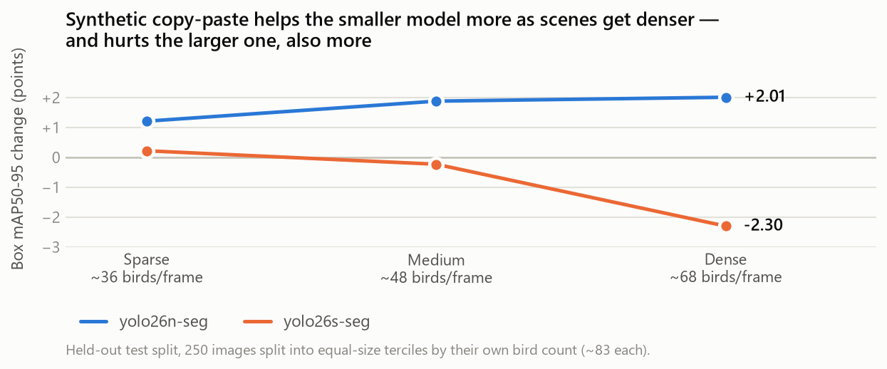
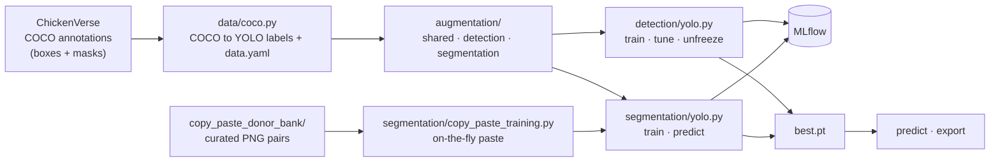

# Poultry Monitoring: Object Detection & Instance Segmentation

     

Detecting and segmenting individual chickens in dense, high-occlusion overhead poultry-farm imagery — applying modern detection and instance-segmentation models to an industrial computer vision problem, with a synthetic data augmentation pipeline for controlling flock density.

<p align="center">
  
</p>

**Status:** 🟡 In progress.

- ✅ **Detection** — `yolo26n` tuned, augmented and progressively unfrozen to val mAP50-95 = 0.893, marginally ahead of ChickenVerse's published baseline.
- ✅ **Segmentation** — baselines and copy-paste arms trained for both sizes, all ahead of the published mask mAP50-95. Copy-paste's effect flips with model size (box mAP50-95 +1.19 on `yolo26n-seg`, −0.72 on `yolo26s-seg`), reproduces on the held-out test split, and scales with scene density — up to **+2.01** on `yolo26n-seg` in the most crowded frames, **−2.30** on `yolo26s-seg`.
- 🔲 **Next** — DETR as a secondary track, DALI data loading, ONNX/LiteRT export with latency benchmarks.

## Table of Contents

- [Dataset](#dataset)
- [Synthetic Copy-Paste Augmentation](#synthetic-copy-paste-augmentation)
- [Results](#results)
  - [Detection](#detection)
  - [Instance Segmentation](#instance-segmentation)
  - [Held-Out Test Split](#held-out-test-split)
  - [The effect scales with scene density](#the-effect-scales-with-scene-density)
  - [Sample Predictions](#sample-predictions)
- [Usage](#usage)
- [Tech Stack](#tech-stack)
- [Architecture](#architecture)
- [Applications & Deployment Realities](#applications--deployment-realities)
- [Project Docs](#project-docs)
- [License](#license)

## Dataset

[**ChickenVerse**](https://github.com/amirivojdan/ChickenVerse) (ChickenDet subset), via [Zenodo](https://zenodo.org/records/20672799):

- 6,539 overhead images from 5 poultry facilities, pre-split into train/validation/test
- 153,764 annotated instances (~23.5 per image, 50+ in the densest frames)
- COCO-format annotations with both bounding boxes and segmentation masks

Released under **CC BY-NC-SA 4.0** and used here strictly for non-commercial, educational purposes. If you use the dataset, cite the original work:

> A. Amirivojdan et al., *"ChickenVerse: An Open Large-Scale Multi-Task Dataset for Chicken Detection, Segmentation, and Behavior Recognition,"* University of Tennessee. [doi.org/10.2139/ssrn.7232911](https://doi.org/10.2139/ssrn.7232911)

## Synthetic Copy-Paste Augmentation

Pasting real, curated bird cutouts into training images to control density and occlusion directly, rather than being limited to whatever density the dataset happened to capture. Runs **inside the training loop** — donors are redrawn every epoch and nothing is written to disk.

<p align="center">
  
</p>

- **Curated donor bank** — occluded and frame-truncated birds are filtered out *before* caching. 26,998 of the Train split's 116,329 annotations pass; 2,000 are cached as browsable PNG image + mask pairs.
- **Overlap-aware placement** — rejection-sampled, so a paste doesn't bury a bird that's already there.
- **Donor-side augmentation** — flip plus full 360° rotation, since overhead imagery has no canonical "up".
- **Domain-aware resize** — each pasted bird's size is drawn from *that scene's own* instance-size distribution, modelling how a real flock's weight (and so apparent size) spreads as it ages.
- **Color-aware compositing** — donors are matched to the target scene's own birds in LAB space, since a donor from one facility's lighting can otherwise carry a visible color cast.

<p align="center">
  
</p>

Design rationale and rejected alternatives are in [ADR 0014](docs/adr/0014-copy-paste-donor-bank-design.md) (donor bank, scene-relative resize), [ADR 0015](docs/adr/0015-color-aware-donor-compositing.md) (color transfer) and [ADR 0017](docs/adr/0017-training-time-copy-paste-augmentation.md) (training-time integration). This is an engineering contribution rather than a new technique — see [Engineering Notes](docs/engineering-notes.md) for the prior art it builds on.

Whether it actually helps — and the model size where it does the opposite — is measured in [Results](#results) below.

## Results

Unless a table says otherwise, numbers are validation-split metrics from an explicit `model.val()` pass after training. **The test split was never used for tuning or comparison decisions** — it was evaluated exactly once, after every decision below was already fixed. See [Held-Out Test Split](#held-out-test-split).

### Detection

| Model | Precision | Recall | mAP50 | mAP50-95 |
|---|---|---|---|---|
| `yolo26n` (this project) | 0.971 | 0.949 | **0.988** | **0.893** |
| `yolo26n` (ChickenVerse published) | — | — | 0.987 | 0.890 |
| `yolo26s` (this project) | 0.967 | 0.951 | 0.989 | 0.904 |
| `yolo26s` (ChickenVerse published) | — | — | 0.990 | 0.919 |

`yolo26n` reaches its result through a different route than the published baseline — Optuna hyperparameter search, a domain-informed directional brightness/contrast augmentation ([ADR 0012](docs/adr/0012-directional-brightness-contrast-augmentation.md)), and progressive unfreezing (3 stages, `freeze` 10→5→0) over ~136 + 3×30 epochs, versus their fixed 20-epoch recipe. `yolo26s` has not had the unfreezing treatment yet, which is roughly the gap `yolo26n` showed before it.

### Instance Segmentation

Deliberately simpler than the detection track — stock Ultralytics config throughout, no search — so that one question stays cleanly answerable: **does [synthetic copy-paste](#synthetic-copy-paste-augmentation) help, as the only changed variable?**

| Model | Box mAP50 | Box mAP50-95 | Mask mAP50 | Mask mAP50-95 |
|---|---|---|---|---|
| `yolo26n-seg` (real data) | 0.985 | 0.884 | 0.986 | 0.835 |
| `yolo26n-seg` (real + synthetic) | 0.989 | **0.896** | 0.989 | 0.835 |
| `yolo26n-seg` (ChickenVerse published) | — | — | 0.986 | 0.810 |
| `yolo26s-seg` (real data) | 0.989 | **0.919** | 0.990 | 0.841 |
| `yolo26s-seg` (real + synthetic) | 0.988 | 0.912 | 0.988 | 0.836 |
| `yolo26s-seg` (ChickenVerse published) | — | — | 0.989 | 0.825 |

With every arm on a pinned optimizer ([ADR 0018](docs/adr/0018-pin-segmentation-optimizer.md)), copy-paste's effect **flips sign with model size** — percentage points, real → real + synthetic:

| | Box mAP50-95 | Box recall | Mask mAP50-95 | Mask recall |
|---|---|---|---|---|
| `yolo26n-seg` | **+1.19** | +0.84 | −0.02 | +0.59 |
| `yolo26s-seg` | **−0.72** | −1.20 | −0.54 | −1.37 |

**Read the box mAP50-95 column; treat the rest as noise.** Mask mAP50-95 swings 0.2–0.8 points *between adjacent epochs* within a single run (0.95–2.82 points of spread across the last 20), so no mask delta here clears its own run's noise. Box mAP50-95 is much steadier at 0.1–0.5 points per epoch, which makes those two numbers readable. The recall columns are shown for completeness but shouldn't be leaned on either — they flip sign between validation and test at both model sizes. Screening every metric against that noise floor is what separates the real result from the apparent one; see [engineering notes](docs/engineering-notes.md).

So copy-paste helps the nano model and hurts the small one. The plausible reading is capacity: `yolo26n-seg` is capacity-limited on this data and extra instances buy it something, while `yolo26s-seg` already fits the real distribution well enough that the composites' artifacts — clean cutout edges, no contact shadows — cost more than the added density is worth. The stopping behaviour points the same way: on `n`, copy-paste trained roughly twice as long before plateauing (75 epochs vs. 38); on `s` it stopped *earlier* (41 vs. 65).

Two caveats: single seed per arm, and the `n` and `s` ablations ran at different batch sizes (16 vs. 8 — `s` plus the donor-bank trainer OOMs an 8GB card), though gradient accumulation holds the effective batch at 64 in both cases. The second one means model size co-varies with batch size across the two ablations, so "capacity" is a hypothesis rather than a demonstrated mechanism; re-running `n` at batch 8 would separate them.

A single number per model also averages away the clearest pattern in the data: both effects **scale with how crowded the scene is**, which only appears once the evaluation is split by density — see [The effect scales with scene density](#the-effect-scales-with-scene-density) below.

### Held-Out Test Split

Everything above is validation. The test split stayed untouched until the ablation was finished, then all four segmentation checkpoints were evaluated on it once.

| Model | Box P | Box R | Box mAP50 | Box mAP50-95 | Mask P | Mask R | Mask mAP50 | Mask mAP50-95 |
|---|---|---|---|---|---|---|---|---|
| `yolo26n-seg` (real data) | 0.903 | 0.891 | 0.948 | 0.754 | 0.903 | 0.891 | 0.947 | 0.702 |
| `yolo26n-seg` (real + synthetic) | 0.916 | 0.885 | 0.949 | 0.771 | 0.919 | 0.888 | 0.951 | 0.710 |
| `yolo26s-seg` (real data) | **0.928** | 0.900 | 0.961 | **0.805** | **0.928** | 0.901 | **0.961** | 0.724 |
| `yolo26s-seg` (real + synthetic) | 0.913 | **0.904** | 0.961 | 0.796 | 0.916 | **0.905** | 0.959 | **0.727** |

Every model drops 11–13 points against its own validation score. That gap is a property of how the splits were built, not evidence of overfitting:

| Split | Images | Distinct resolutions | Median birds/img | Max |
|---|---|---|---|---|
| Train | 5,222 | 9 | 20 | 106 |
| Validation | 1,067 | 2 | 27 | 36 |
| Test | 250 | 1 (1280×720, absent from Validation) | 48 | 89 |

Validation's *densest* frame holds 36 birds — below the test split's *median* of 48. Density and occlusion are the whole difficulty of this dataset, so a validation split sitting at the sparse end reads optimistically, and the test figures are the better estimate of a crowded real scene.

The copy-paste result reproduces on this unseen data: box mAP50-95 **+1.66** on `yolo26n-seg` and **−0.90** on `yolo26s-seg`, the same directions found on validation. The gain on `n` is *larger* here than on validation, which is what an augmentation built to manufacture density should do when the evaluation gets denser.

Precision and recall move in mirror image, which the mAP columns hide — percentage points, real → real + synthetic:

| | Box precision | Box recall | Mask precision | Mask recall |
|---|---|---|---|---|
| `yolo26n-seg` | **+1.31** | −0.59 | **+1.60** | −0.23 |
| `yolo26s-seg` | −1.49 | **+0.38** | −1.18 | **+0.40** |

On `n`, copy-paste buys precision at recall's expense; on `s` it does the reverse. That matters for picking a checkpoint, because the downstream tasks are not symmetric: for counting and mortality tracking a missed bird is a silent undercount, while a false positive shows up as an implausible headcount. On that criterion `yolo26s-seg` + copy-paste is the pick — it has the best mask recall (0.905) and the best mask mAP50-95 (0.727) of any arm — even though the plain `s` baseline wins on box mAP50-95.

### The effect scales with scene density

The single aggregate number per model hides the most useful pattern. Splitting the test split into equal-size thirds by each image's own bird count, and re-scoring every checkpoint per bin:

<p align="center">
  
</p>

| Box mAP50-95 change | Sparse (~36 birds) | Medium (~48) | Dense (~68) |
|---|---|---|---|
| `yolo26n-seg` | +1.21 | +1.88 | **+2.01** |
| `yolo26s-seg` | +0.22 | −0.23 | **−2.30** |

Both trends are monotonic in density, in opposite directions. On `yolo26n-seg` synthetic data helps, and **helps more the more crowded the scene** — which is the behaviour you would want from an augmentation whose purpose is manufacturing density. On `yolo26s-seg` it hurts, and the damage is almost entirely in the dense third; in sparse frames it is harmless.

Why the larger model responds the opposite way is not something this project chased down — it is stated as observed, not explained.

Scope caveat: the test split is 250 frames from a single camera at one resolution. It is a good density-shift probe and a poor multi-site generalization test — the cross-facility question in [Applications & Deployment Realities](#applications--deployment-realities) is still open.

### Sample Predictions

Test-split frames, never used for training or tuning. Boxes only for detection, masks only for segmentation — a "Chicken" label on 50 boxes is noise for a single-class dataset.

| Ground truth | Prediction (`yolo26n`) |
|---|---|
|  |  |
|  |  |

56 ground-truth birds vs. 60 predicted in the first frame, 42 vs. 44 in the second — the extras are mostly genuine partial birds at the frame edge.

| Ground truth | `yolo26n-seg` | `yolo26s-seg` |
|---|---|---|
|  |  |  |

`yolo26s-seg` recovers a few birds `n` misses; both correctly mask a bird almost entirely hidden behind a support pole. Colors are per-instance and random, so they don't correspond between panels.

## Usage

```bash
uv sync --extra dev   # installs deps incl. jupyter/torchinfo; verify torch.cuda.is_available()
```

`--data-dir` points at a ChickenDet root containing `images/` and `annotations/`.

**Detection**

```bash
# Hyperparameter search (in-process Optuna) and custom augmentation search
uv run python -m poultry_monitoring.detection.yolo tune --data-dir data/ChickenDet \
    --iterations 20 --epochs 15 --fraction 0.3
uv run python -m poultry_monitoring.detection.yolo augtune --data-dir data/ChickenDet \
    --trials 8 --epochs 15 --fraction 0.3

# Fine-tune one size, then refine it with progressive unfreezing
uv run python -m poultry_monitoring.detection.yolo train --data-dir data/ChickenDet \
    --model-name yolo26n --variant tuned --epochs 300 --patience 15
uv run python -m poultry_monitoring.detection.yolo unfreeze --data-dir data/ChickenDet \
    --model-name yolo26n --initial-weights <path/to/best.pt>

# Inference
uv run python -m poultry_monitoring.detection.yolo predict --weights <path/to/best.pt> \
    --source path/to/images --conf 0.36 --save-dir predictions/
```

**Segmentation**

```bash
# Train on real data only
uv run python -m poultry_monitoring.segmentation.yolo train --data-dir data/ChickenDet \
    --model-name yolo26n-seg --variant baseline --epochs 100 --data-source real

# Build the curated donor bank once
uv run python -m poultry_monitoring.augmentation.segmentation build-bank \
    --annotations data/ChickenDet/annotations/instances_Train.json \
    --img-dir data/ChickenDet/images/Train \
    --bank-dir data/ChickenDet/copy_paste_donor_bank --max-donors 2000 --seed 42

# Same config, with synthetic copy-paste as the only changed variable
uv run python -m poultry_monitoring.segmentation.yolo train --data-dir data/ChickenDet \
    --model-name yolo26n-seg --variant synth_copy_paste --epochs 100 \
    --copy-paste-bank data/ChickenDet/copy_paste_donor_bank --data-source synthetic

# Score a checkpoint on the held-out test split, and per density bin
# (reproduces both test tables and the density figure above)
uv run python -m poultry_monitoring.segmentation.yolo val --data-dir data/ChickenDet \
    --weights <path/to/best.pt> --split Test --by-density --output test_metrics.json

# Inference, masks only
uv run python -m poultry_monitoring.segmentation.yolo predict --weights <path/to/best.pt> \
    --source path/to/image --masks-only --save-dir predictions/
```

**Preview augmentations** (pure Albumentations/numpy — no GPU, safe to run alongside a live training job):

```bash
uv run python -m poultry_monitoring.augmentation.visualize \
    --image <image.jpeg> --label <label.txt> --n-samples 6 --save preview.png
```

**Experiment tracking** — every run logs params, per-epoch metrics and final validation metrics:

```bash
uv run mlflow ui --backend-store-uri sqlite:///mlflow.db
```

Export/benchmark entry points don't exist yet — see [`plan.md`](plan.md).

## Tech Stack

- **[Ultralytics YOLO26](https://docs.ultralytics.com/)** — anchor-free/NMS-free CNN detector and segmenter; the model this project productionizes
- **[Albumentations](https://albumentations.ai/)** — domain-specific augmentation (color invariance, lighting, occlusion simulation)
- **[MLflow](https://mlflow.org/)** — experiment tracking, local SQLite store
- **PyTorch** — underlying training framework
- **[DETR](https://huggingface.co/docs/transformers/model_doc/detr)** — transformer-based detector; a secondary practice track
- **[NVIDIA DALI](https://developer.nvidia.com/dali)**, **[ONNX Runtime](https://onnxruntime.ai/)**, **[LiteRT](https://ai.google.dev/edge/litert)** — planned, for GPU data loading and export/optimization

## Architecture



Full module-by-module layout is in [`CLAUDE.md`](CLAUDE.md) § Package Layout.

## Applications & Deployment Realities

Per-bird detection and segmentation is the primitive that precision livestock farming is missing. A commercial broiler house holds 20,000–50,000 birds and is inspected by a person walking through it once or twice a day — which means welfare problems are found late, and found by whoever happens to be looking.

**What per-bird output enables:**

- **Counting and mortality tracking** — automated headcounts, and the delta between them, without manual inspection. Mortality rate is the single most-watched number in a grow-out cycle.
- **Density and distribution mapping** — birds cluster away from cold spots, crowd toward failing ventilation, and avoid wet litter. A density heatmap over time surfaces an environmental fault days before it shows up in weight or mortality.
- **Feeder and drinker dwell time** — time spent at resources is a leading indicator of both flock health and equipment failure. A blocked drinker line looks like a sudden drop in dwell time at one location.
- **Individual behavior** — walking, standing, lying ratios; lameness in broilers is a major welfare and economic issue and shows up first as changed activity.
- **Anomaly surfacing** — isolated or motionless birds flagged out of a continuous feed, rather than found on the next walkthrough.

### Why a model trained on five facilities doesn't simply transfer

Each of these breaks the independent and identically distributed assumption in a different way, and all of them are guaranteed to differ at a new site:

- **Camera geometry** — mounting height, angle and lens differ per installation, so apparent bird size and the degree of overhead foreshortening change.
- **Lighting** — facilities run different light programmes and intensities, and lighting shifts across the day. ChickenVerse's own five facilities already differ enough that a bird cut from one looks visibly wrong pasted into another.
- **Litter** — colour and composition change with bedding material, age and moisture, moving the entire background distribution.
- **Flock age** — a broiler goes from a small pale chick to a full-size bird over a ~6-week cycle. A model calibrated on one age band degrades as the flock grows, *within a single deployment*.
- **Breed and equipment layout** — plumage differs; feeder and drinker lines create occluders in different places.

### Cold-starting a new installation

This is where synthetic data stops being a benchmark trick and becomes the thing that makes deployment economically viable.

The obstacle to installing at a new farm is that the model needs site-specific training data, and labelling it is brutal: at 23–50 birds per frame with pixel-level masks, even 200 frames means roughly 7,000 instance masks. That's days of annotation per house — which does not scale to hundreds of installations, and has to be repeated whenever conditions change.

The copy-paste pipeline collapses that. **Donors already exist** in the curated bank, so a new site only has to contribute *unlabeled* frames from its own camera. Paste curated birds into them and the labels come for free, in the site's own lighting, litter and camera geometry:

1. Capture background frames from the newly-installed camera — empty house, or lightly populated.
2. Composite curated donors in, matched to that site's conditions, generating exact masks by construction.
3. Fine-tune on the result before the house is even fully stocked.

The same mechanism covers the flock-age problem: because pasted-bird size is drawn from a distribution rather than fixed, a training set can be generated to span the size range a flock will pass through, instead of waiting to collect real data at each stage.

**Bootstrapping the site's own reference data.** The pipeline derives its colour and size references from real annotated instances in the target scene, so a brand-new site needs a seed set — and annotating one by hand would reintroduce the cost this is meant to remove. A promptable segmenter (SAM) closes that loop: prompt it with boxes from the existing model, which only has to be roughly right about *where* birds are, and keep only the masks that pass the donor bank's existing occlusion and border filters. That yields both the statistics *and* a **site-native donor bank**, which removes the *installation-fixed* sources of mismatch — camera geometry, litter, breed, equipment layout.

It does not remove the time-varying ones, and those are substantial within a single house: curtain and light management, daylight shifting across the day, and birds visibly changing as the flock ages. A bank harvested over weeks therefore spans many lighting states and several age bands, which makes the scene-relative colour and size matching *more* load-bearing here, not less — it's what lets one time-spanning bank serve every frame, instead of having to bucket donors by hour and flock age. Anyone running this in production would likely want donors tagged with harvest time and flock age so sampling can be conditioned on them; out of scope here, but noted in [ADR 0014](docs/adr/0014-copy-paste-donor-bank-design.md) § Consequences.

The caveat is that dense occlusion is where promptable segmenters are weakest (two touching white birds can merge into one mask), and pseudo-label noise would propagate into donors, statistics and labels alike — so the filtering has to be deliberately strict, keeping few, clean masks rather than many. Tracked in [`plan.md`](plan.md) § Future Work; an extension, not something demonstrated here.

A synthetic-only model would also want validating against real held-out frames from the site before trusting it — composited images lack real contact shadows, motion blur and genuine occlusion contact, and a model can learn compositing artefacts. The realistic framing is synthetic data for cold-start and continuous adaptation, with a small real set for verification.

## Project Docs

| Doc | What's in it |
|---|---|
| [`plan.md`](plan.md) | Phased roadmap and live status — the first place to check for "where are we right now" |
| [`docs/engineering-notes.md`](docs/engineering-notes.md) | Empirical findings, including negative results and the bugs found along the way |
| [`docs/adr/`](docs/adr/README.md) | Architecture Decision Records — design calls and their rejected alternatives |
| [`constitution.md`](constitution.md) | Project principles: code style, notebook-first workflow, benchmarking rigor |
| [`CLAUDE.md`](CLAUDE.md) | Working conventions: package layout, MLflow schema, gate commands |
| [Root `README.md`](../README.md) | How this project fits into the broader portfolio |

## License

**Code** is licensed [AGPL-3.0](LICENSE) — copyleft, extending to network use (§13). This is required by the Ultralytics dependency, which this project subclasses.

**Dataset, donor bank and trained weights** are **CC BY-NC-SA 4.0** — non-commercial, attribution, share-alike — inherited from ChickenVerse and binding on anything derived from it. None of these artifacts are distributed here, but the restriction follows them.

See [`NOTICE`](NOTICE) for the full breakdown and third-party licenses, and [`CITATION.cff`](CITATION.cff) if you build on this work.
