# Poultry Monitoring: Object Detection & Instance Segmentation

    

Detecting and segmenting individual chickens in dense, overhead poultry farm imagery — a portfolio project applying modern object detection and segmentation architectures to an industrial computer vision problem. **YOLO26 is the primary deliverable**; a DETR track exists as separate practice with transformer architectures, not a gating comparison (see [`CLAUDE.md`](CLAUDE.md) § Project Intent).

<p align="center">
  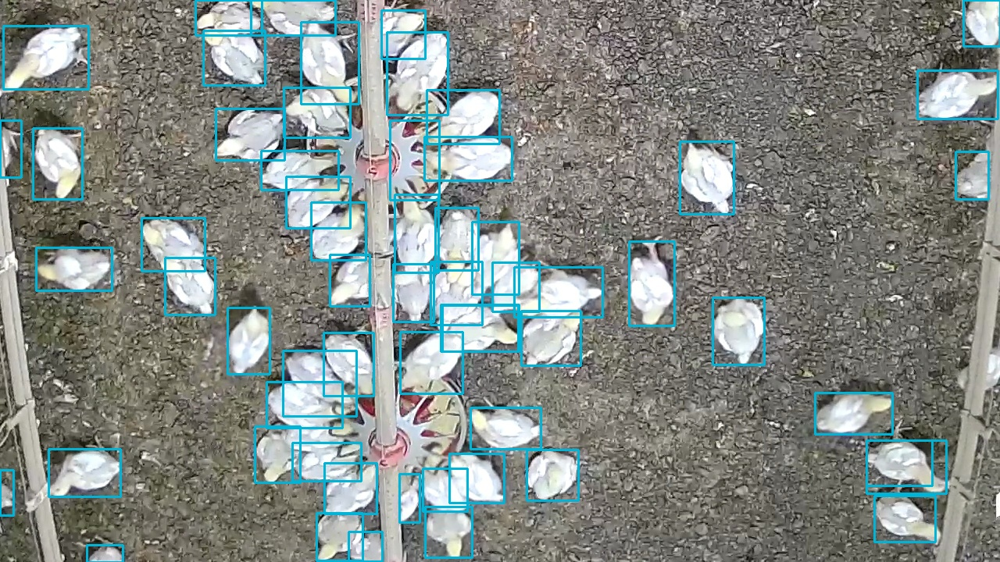
</p>

**Status:** 🟡 In progress — `yolo26n` tuned, trained, and progressively unfrozen (val mAP50 = 0.987, mAP50-95 = 0.892), comparable to ChickenVerse's own published baseline; `yolo26s` trained (close on mAP50, gap remains on mAP50-95 — no unfreezing applied yet). See [Status](#status) for the full picture and [`plan.md`](plan.md) for the live phase-by-phase roadmap.

## Table of Contents

- [Dataset](#dataset)
- [Industrial Applications & Real-World Challenges](#industrial-applications--real-world-challenges)
- [Tech Stack](#tech-stack)
- [Architecture](#architecture)
- [Usage](#usage)
- [Results](#results)
- [Segmentation Results](#segmentation-results)
- [Key Findings](#key-findings)
- [Synthetic Copy-Paste Data Augmentation](#synthetic-copy-paste-data-augmentation)
- [Portfolio Scope & Objectives](#portfolio-scope--objectives)
- [Project Docs](#project-docs)
- [Status](#status)

## Dataset

[**ChickenVerse**](https://github.com/amirivojdan/ChickenVerse) (ChickenDet subset), via [Zenodo](https://zenodo.org/records/20672799):

- 6,539 overhead-view images from 5 poultry facilities
- 153,764 annotated chicken instances (~23.5 per image on average, up to 50+ in the test split)
- COCO-format annotations with both bounding boxes and pixel-level segmentation masks
- Pre-split into train / validation / test sets

### License

ChickenVerse is released under **CC BY-NC-SA 4.0** (Attribution-NonCommercial-ShareAlike). It is used here strictly for **non-commercial, educational/portfolio purposes**, with attribution to the original authors. Any derivative work or adaptation must be shared under the same license.

### Citation

This project's models are trained entirely on ChickenVerse. If you use the dataset itself, cite the original work:

> A. Amirivojdan et al., *"ChickenVerse: An Open Large-Scale Multi-Task Dataset for Chicken Detection, Segmentation, and Behavior Recognition,"* University of Tennessee. [doi.org/10.2139/ssrn.7232911](https://doi.org/10.2139/ssrn.7232911)

## Industrial Applications & Real-World Challenges

Automated visual monitoring of poultry flocks has direct relevance to precision livestock farming:

- **Flock counting** — automated headcounts without manual inspection
- **Density & welfare monitoring** — detecting overcrowding or abnormal distribution, an early welfare indicator
- **Behavioral analysis** — time spent near feeders and water outlets, and time spent walking, laying, or standing, as activity/welfare indicators
- **Automated inspection** — surfacing anomalies (e.g. isolated or motionless birds) from continuous camera feeds
- **Scalable monitoring** — replacing manual, spot-check inspection with continuous, camera-based coverage across facilities

A production system for this problem has to hold up against conditions this dataset won't necessarily cover on its own: varying litter color/composition, inconsistent lighting between facilities and times of day, differing camera distance/angle across installations, and birds changing in size and appearance as a flock ages. Worth keeping in mind when interpreting results and generalizing beyond this dataset.

**Future work:** the detection/segmentation output is the foundation for a small analytics dashboard — extracting per-video metrics (counts, density over time, feeder/water-outlet dwell time, behavior breakdowns) from farm house footage. See [`plan.md`](plan.md) § Future Work for the full backlog.

## Tech Stack

- **[Ultralytics YOLO26](https://docs.ultralytics.com/)** — real-time, anchor-free/NMS-free CNN detector and segmenter; the model this project actually productionizes
- **[Albumentations](https://albumentations.ai/)** — custom domain-specific augmentation (color invariance, lighting/contrast, occlusion simulation), chosen over DALI for augmentation specifically — richer transform set, no GPU-memory contention with training
- **[NVIDIA DALI](https://developer.nvidia.com/dali)** — GPU-accelerated data *loading*, evaluated later only if profiling shows it's the actual bottleneck
- **[MLflow](https://mlflow.org/)** — experiment tracking (local SQLite store), via Ultralytics' native integration
- **[DETR](https://huggingface.co/docs/transformers/model_doc/detr)** (Hugging Face `transformers`) — transformer-based, set-prediction detector/segmenter; a secondary practice track, not gating the above
- **[ONNX Runtime](https://onnxruntime.ai/)** and **[TensorFlow Lite / LiteRT](https://ai.google.dev/edge/litert)** — model export and optimization for deployment
- **PyTorch** as the underlying training framework

## Architecture

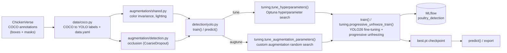

Custom augmentation search runs separately from `model.tune()` because Ultralytics' tuner executes each trial as its own subprocess, which can't carry live Python objects like a custom Albumentations transform list — see [ADR 0001](docs/adr/0001-custom-augmentation-search-separate-from-tuner.md). Both search results feed into `train()`, which fine-tunes a checkpoint, validates the best epoch, and logs everything to MLflow via [ADR 0003](docs/adr/0003-native-mlflow-integration.md)'s native integration.

Full package layout (module-by-module, including the not-yet-built segmentation/DALI/export pieces) lives in [`CLAUDE.md`](CLAUDE.md) § Package Layout — this diagram covers the detection path that's actually implemented today.

## Usage

```bash
uv sync --extra dev   # installs deps incl. jupyter/torchinfo; verify torch.cuda.is_available()
```

Everything below runs through `detection/yolo.py`'s CLI (`--data-dir` points at a ChickenDet
root containing `images/` and `annotations/`):

```bash
# Hyperparameter search on yolo26n (in-process Optuna, not Ultralytics' native tuner — ADR 0005)
uv run python -m poultry_monitoring.detection.yolo tune --data-dir data/ChickenDet \
    --iterations 20 --epochs 15 --fraction 0.3

# Custom Albumentations parameter search (color invariance, lighting/contrast, occlusion)
uv run python -m poultry_monitoring.detection.yolo augtune --data-dir data/ChickenDet \
    --trials 8 --epochs 15 --fraction 0.3

# Fine-tune one size with fixed hyperparameters (e.g. a winning tune/augtune result)
uv run python -m poultry_monitoring.detection.yolo train --data-dir data/ChickenDet \
    --model-name yolo26n --variant tuned --epochs 300 --patience 15 \
    --hyperparameters-json '{"lr0": 0.01, "fliplr": 0.5, "p_lighting": 0.12}'

# Progressive-unfreezing refinement on top of an already-trained checkpoint: three stages of
# decreasing freeze (10 -> 5 -> 0) and decreasing lr0 (5e-4 -> 1e-4 -> 2e-5), each continuing
# from the previous stage's best weights — see DEFAULT_UNFREEZE_STAGES in detection/tuning.py
uv run python -m poultry_monitoring.detection.yolo unfreeze --data-dir data/ChickenDet \
    --model-name yolo26n --initial-weights data/ChickenDet/YOLO/yolo26n-tuned/weights/best.pt \
    --hyperparameters-json '{"lr0": 0.01, "fliplr": 0.5, "p_lighting": 0.12}'

# Full pipeline: tune, then train every size in --sizes with the winning config
uv run python -m poultry_monitoring.detection.yolo sweep --data-dir data/ChickenDet \
    --sizes n s --train-epochs 300 --train-patience 15

# Inference on your own images with a trained checkpoint
uv run python -m poultry_monitoring.detection.yolo predict \
    --weights data/ChickenDet/YOLO/yolo26n-tuned/weights/best.pt \
    --source path/to/image_or_directory --conf 0.36 --save-dir predictions/
```

**Visualize what the custom augmentations actually do** to a sample image (and its boxes,
if a label file is given) before committing to a search over their parameters — pure
Albumentations/numpy, no GPU needed, so it's safe to run alongside a live GPU training job
(unlike everything above, which all touch torch):

```bash
uv run python -m poultry_monitoring.augmentation.visualize \
    --image data/ChickenDet/images/Train/<file>.jpeg \
    --label data/ChickenDet/labels/Train/<file>.txt \
    --shared p_color_invariance=1.0 p_lighting=1.0 \
    --detection p_occlusion=1.0 \
    --n-samples 6 --save augmentation_preview.png
```

`--shared`/`--detection` are `key=value` overrides for `augmentation/shared.py` (color
invariance, lighting/contrast) and `augmentation/detection.py` (occlusion simulation via
`CoarseDropout`) respectively — omit `--save` to open an interactive window instead.

**Experiment tracking** — every `train`/`unfreeze`/`sweep` run logs params, per-epoch
metrics, and final `box_map50`/`box_map50_95`/`box_precision`/`box_recall` to MLflow under
the `poultry_detection` experiment:

```bash
uv run mlflow ui --backend-store-uri sqlite:///mlflow.db
```

Export/benchmark CLI entry points don't exist yet — Phase 6 in [`plan.md`](plan.md).

## Results

| Model | Split | Precision | Recall | mAP50 | mAP50-95 | Notes |
|---|---|---|---|---|---|---|
| `yolo26n` (this project) | val | 0.971 | 0.949 | 0.988 | 0.893 | Tuned hyperparameters + directional (asymmetric) brightness/contrast augmentation + progressive unfreezing (3 stages, `freeze` 10→5→0), full dataset — see [ADR 0012](docs/adr/0012-directional-brightness-contrast-augmentation.md). |
| `yolo26n` (ChickenVerse published) | val | — | — | 0.987 | 0.890 | Reference baseline, same architecture/scale — this project's number is now marginally ahead (Δ +0.003 mAP50-95), reached via a different training approach; see below. |
| `yolo26s` (this project) | val | 0.967 | 0.951 | 0.989 | 0.904 | Tuned config (pre-[ADR 0012](docs/adr/0012-directional-brightness-contrast-augmentation.md)), straight `train()` — **no** progressive unfreezing or the directional augmentation applied yet. |
| `yolo26s` (ChickenVerse published) | val | — | — | 0.990 | 0.919 | Reference baseline — close on mAP50, a real gap remains on mAP50-95 (same shape `yolo26n` had *before* unfreezing). |

All numbers are validation-split metrics from an explicit `model.val()` pass after training (not training-loop numbers). ChickenVerse's own benchmark table reports two separate mAP columns — only the `val_mAP50`/`val_mAP50-95` ones are comparable to the numbers above; see [`plan.md`](plan.md) Phase 2 for the full note. **The test split is intentionally not used for any comparison or tuning decision**, to avoid implicitly fitting it.

### Training Configuration

`yolo26n`'s result above is now marginally ahead of ChickenVerse's own published number, but the two were reached through different training setups — the interesting comparison is the approach, not the third decimal place:

| Parameter | This project | ChickenVerse ([source](https://github.com/amirivojdan/ChickenVerse)) |
|---|---|---|
| Epochs | ~136 (cold-start, patience-based, best at epoch 119) + 3×30 (progressive unfreezing) | 20 (fixed) |
| Patience | 15 (initial), 3 (unfreeze stages) | 10 |
| Layer freezing | Progressive: 3 stages, `freeze` 10→5→0, `lr0` 5e-4→1e-4→2e-5 | All layers unfrezeed — a single `model.train()` call per model variant |
| Hyperparameter search | In-process Optuna over a conservative, hand-curated space ([ADR 0008](docs/adr/0008-conservative-hyperparameter-space.md)/[0009](docs/adr/0009-revert-to-in-process-optuna-trials.md)) — its own winner underperformed and wasn't adopted ([ADR 0011](docs/adr/0011-conservative-search-result-not-adopted.md)) | Fixed, not searched |
| Custom augmentation | Directional (asymmetric) brightness/contrast bias, color invariance, randomized autocontrast, occlusion simulation (Albumentations) — [ADR 0012](docs/adr/0012-directional-brightness-contrast-augmentation.md) | Ultralytics' stock augmentation, unmodified |
| Batch size | Ultralytics auto-batch | 16 (fixed) |
| Experiment tracking | Every run logged to MLflow | Not present in their notebook |

Comparable results from meaningfully different budgets and approaches — theirs a straightforward, fast 20-epoch benchmark across 8 model variants in one notebook; this project's a slower, deliberately tuned/searched/unfrozen path on one model at a time.

This table reflects `yolo26n`'s final, adopted configuration — Phase 2 is done; [`plan.md`](plan.md) Phase 3 (segmentation) is where things are currently in flight.

### Sample Predictions

Two images from the **test split** — never used for training, tuning, or any validation-based decision — run through `yolo26n`'s final checkpoint (`conf=0.36`, CPU inference). Ground truth alongside each prediction, same images. Boxes only, no per-instance labels — with ~50 birds in frame, a "Chicken" tag on every box is noise, not signal, for a single-class dataset:

| Ground truth | Prediction |
|---|---|
| 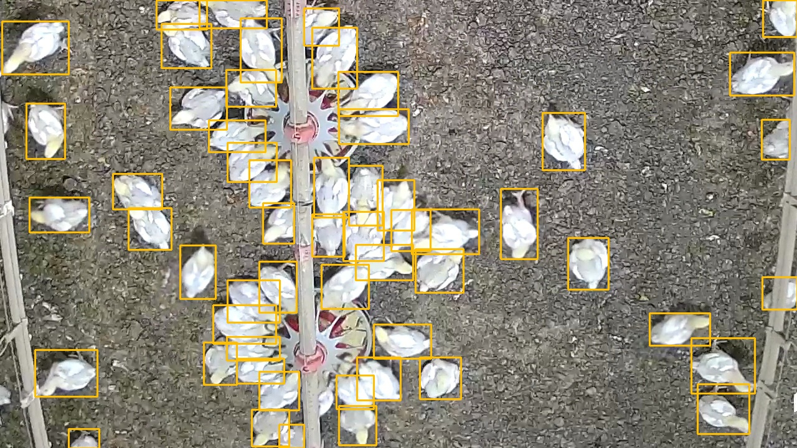 |  |
| 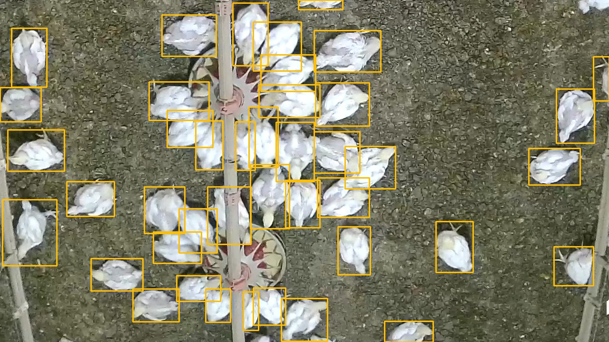 | 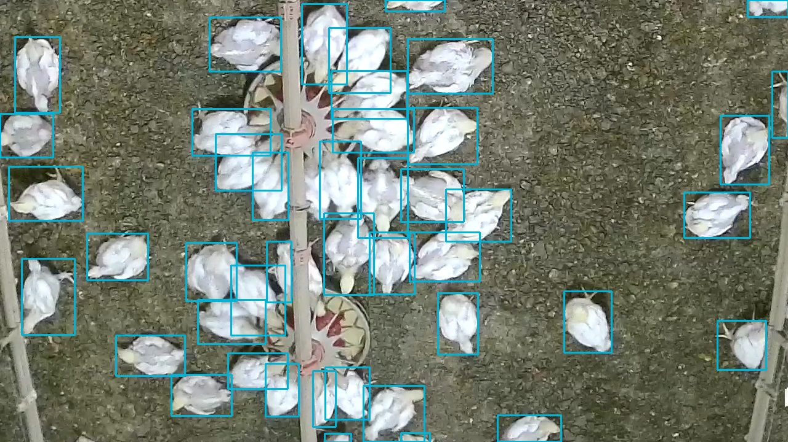 |

56 ground-truth birds vs. 60 predicted in the first image, 42 vs. 44 in the second — close counts, and the extra predictions are mostly genuine partial birds at the frame edge that the model still caught. This is genuinely what "~23 birds/image, up to 50+" looks like at full resolution — the box density is the scene, not a rendering artifact.

## Segmentation Results

Phase 3 (instance segmentation) baselines — `yolo26n-seg` and `yolo26s-seg`, stock hyperparameters, no custom augmentation or unfreezing applied yet (that treatment comes later, mirroring the detection track):

| Model | Split | Box P | Box R | Box mAP50 | Box mAP50-95 | Mask P | Mask R | Mask mAP50 | Mask mAP50-95 |
|---|---|---|---|---|---|---|---|---|---|
| `yolo26n-seg` (baseline) | val | 0.964 | 0.948 | 0.985 | 0.888 | 0.965 | 0.949 | 0.986 | 0.830 |
| `yolo26n-seg` (ChickenVerse published) | val | — | — | — | — | — | — | 0.986 | 0.810 |
| `yolo26s-seg` (baseline) | val | 0.961 | 0.954 | 0.987 | 0.894 | 0.962 | 0.956 | 0.989 | 0.848 |
| `yolo26s-seg` (ChickenVerse published) | val | — | — | — | — | — | — | 0.989 | 0.825 |

`yolo26s-seg` is ahead of `yolo26n-seg` on every mAP/mask metric above, as expected for the larger backbone; both of this project's checkpoints are also slightly ahead of ChickenVerse's own published mask mAP50-95 for the same architecture. Box/precision/recall aren't published for the ChickenVerse rows here — their table doesn't expose a directly comparable column for those, only for mask mAP (see `plan.md` for the same `val_`-column caveat that applies to the detection table above).

### Sample Predictions

Same held-out test frame (`frame_41_620.47s.jpg`), ground truth alongside both checkpoints' predictions — masks only, no boxes, each instance in a distinct random color, since a same-class box/label on every one of ~50 birds is noise, not signal. Predictions use `segmentation/yolo.py predict --masks-only` (`Results.plot(boxes=False, labels=False, color_mode="instance")`); ground truth uses `segmentation/visualize.py`'s label-rasterization helpers, so the two are rendered by different code paths and won't share a color mapping — only per-image instance count and shape are meant to be compared:

| Ground truth | `yolo26n-seg` | `yolo26s-seg` |
|---|---|---|
| 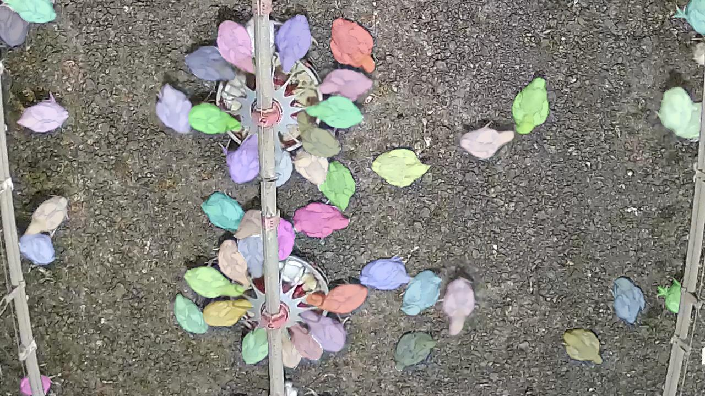 | 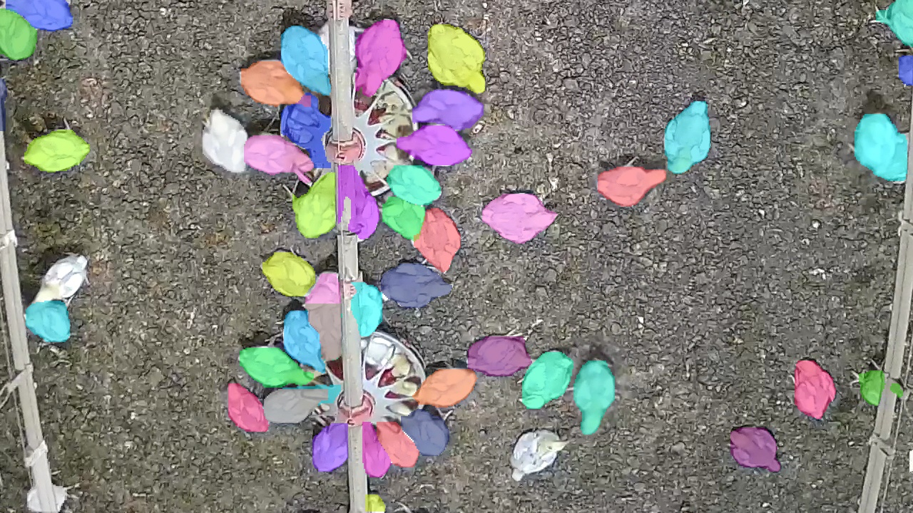 | 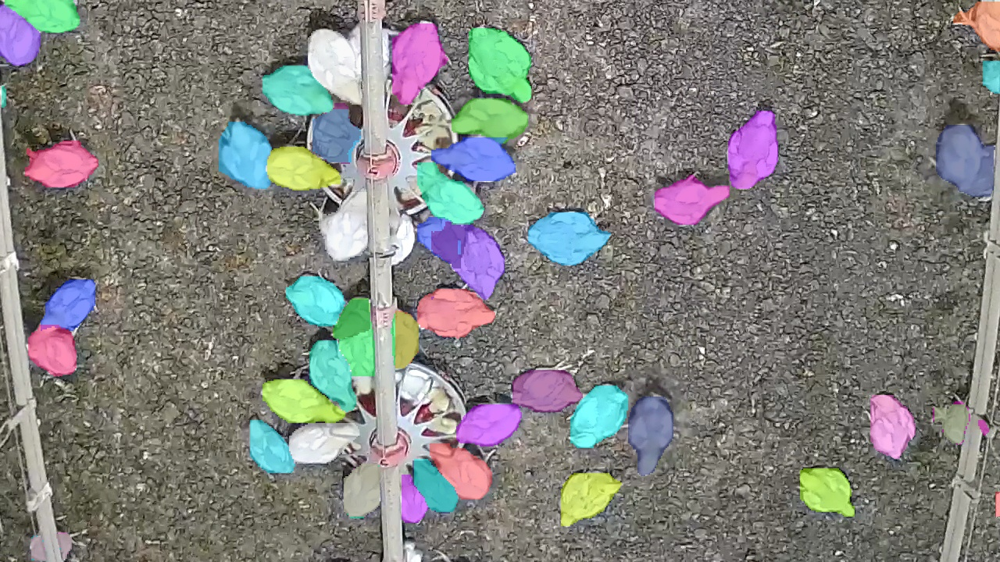 |

- **`yolo26n-seg` misses a handful of birds that `yolo26s-seg` recovers** — most visibly a white/pale bird right at one of the feeder trays, unmasked in `n` and correctly picked up in `s`.
- **Both models correctly detect a bird mostly hidden behind a support pole** (bottom-left corner) — at first glance this looked like a false positive on the bare pole/wire-tie, but the ground truth confirms a real, heavily-occluded bird annotated right at the pole base. Both `n` and `s` mask it, a good sign for occlusion handling given how central occlusion robustness is to this dataset.

## Key Findings

Learnings worth keeping visible here, not just buried in `plan.md`'s working history:

- **Ultralytics' genetic tuner doesn't meaningfully explore from a fixed starting point** ([ADR 0005](docs/adr/0005-genetic-tuner-undersearches-from-a-fixed-start.md)) — caught mid-run: a follow-up `multi_scale` search (range `0.0`–`0.3`) never sampled anything past `~1e-4`. Traced to the tuner's source: mutation is purely *multiplicative* from the current population, and when that population has no real diversity yet (true for every parameter on iteration 2, since iteration 1 is always unmutated defaults), the crossover step's fallback only injects a tiny random nudge — never a meaningful jump across a wide range. The uncomfortable implication: the *original* built-in-augmentation search likely had the same problem — its winning "iteration 1" was literally unmutated defaults, never beaten across 20 iterations. **Fixed**: `tune_hyperparameters` now runs Optuna's TPE sampler instead, unified with the custom Albumentations search into one joint pass.
- **A "successful" 40-trial search turned out to be silent garbage** ([ADR 0007](docs/adr/0007-subprocess-per-optuna-trial.md), later reverted by [ADR 0009](docs/adr/0009-revert-to-in-process-optuna-trials.md)) — exit code 0, a printed "best" result, all 40 trials nominally complete. In reality, trials 3-39 each failed in ~1.3 seconds (far too fast to train anything) and were silently scored `0.0` by an overly broad exception handler with no logging. Root cause, found through live process/memory monitoring rather than guessing: running 40 real training calls in one long-lived Python process orphans DataLoader **worker processes** (Windows `spawn`-based multiprocessing) that accumulate across trials and exhaust system RAM — not GPU VRAM, which a first fix attempt (`torch.cuda.empty_cache()`) wrongly targeted. `workers=0` confirmed the mechanism by eliminating it entirely (no leak, but ~5-6x slower); `workers=4` still leaked, just slower. **Fixed** at the time by running each trial as its own subprocess; **later reverted** in favor of a plain in-process Optuna objective for a simpler, easier-to-read main script, deliberately re-accepting this risk rather than re-solving it.
- **Test-time preprocessing doesn't help** ([ADR 0004](docs/adr/0004-no-test-time-preprocessing.md)) — autocontrast/CLAHE/histogram-equalization applied only at inference (no retraining) on a trained checkpoint were flat-to-negative: autocontrast was a wash (≤0.001 on every metric — the model already saw similarly mild autocontrast during training), while CLAHE and histogram-equalization measurably hurt (−0.013 to −0.014 mAP50-95) by creating a train/inference distribution mismatch instead of correcting one.
- **`close_mosaic` must scale with stage length, not get inherited from a different run's tune result** — reusing `close_mosaic=10` (sized for a 300-epoch run) unchanged on 30-epoch progressive-unfreezing stages disabled mosaic for the last third of each stage, visible below as a sharp train-loss drop plus a transient val-loss/mAP50-95 dip right at epoch 20 (mosaic switches off at `epoch == epochs - close_mosaic`). Fixed with two rules of thumb: `epochs >> close_mosaic`, and `patience < close_mosaic` (since Ultralytics' `best.pt` always tracks the best-ever-observed fitness regardless of when training stops, a shorter patience bounds how much of a bad post-transition regime gets trained through before reverting).

  
- **`AutoContrast`'s cutoff needed to vary per-application, not get tuned to one fixed value** — Albumentations' `RandomBrightnessContrast` auto-symmetrizes a tuned scalar into a fresh `±range` every call, but `AutoContrast.cutoff` doesn't have that built in; the augmentation search had converged it to a single always-identical value. Fixed with a small subclass that resamples `cutoff` from a fixed range each application instead.
- **`copy_paste_mode` (`"flip"` vs `"mixup"`) is a wash at proxy scale** — every metric within 0.006 between the two; not a meaningful lever for this dataset as tested, despite a real theoretical scale-mismatch risk for `"mixup"` (unmatched cutout/background scale) that didn't clearly show up in the numbers either.
- **A conservative, hand-curated search space still found a losing config** ([ADR 0008](docs/adr/0008-conservative-hyperparameter-space.md), [ADR 0011](docs/adr/0011-conservative-search-result-not-adopted.md)) — narrowing the search space (down from a near-copy of Ultralytics' own wide `Tuner.space`) didn't guarantee a winner. A real 16-trial run's best trial, applied at full scale, underperformed the pre-session baseline in *both* cold-start (`Δ −0.0286` mAP50-95) and warm-start/continued-fine-tuning (`Δ −0.0169`) regimes — confirmed via matched-config re-runs, not just a one-off. The cold-start run's per-epoch curve converged completely normally (no instability); it simply plateaued at a genuinely worse optimum. Not adopted — production stays on the pre-session near-default augmentation config.
- **Third time was the charm for the "birds are white, background is dark litter" idea** ([ADR 0012](docs/adr/0012-directional-brightness-contrast-augmentation.md)) — two earlier attempts at the same observation both failed: a fixed test-time-only transform (entry above, worse than the original CLAHE/hist-eq failures), and via the ADR 0011 search. What worked was applying it as an *asymmetric, training-time* augmentation instead — `RandomBrightnessContrast` with `brightness_limit=(-0.35,-0.05)`, `contrast_limit=(0.3,0.7)` (always darken, always boost contrast, but still resampled per call, not fixed) — needing zero new code, since Albumentations already accepts asymmetric-tuple limits and this project's hyperparameter plumbing already passes values through untouched. Behind the baseline through the first two progressive-unfreeze stages, only overtaking once the whole backbone is trainable: `box_map50_95=0.8929` vs. the prior best `0.8919` (`Δ +0.0010`), `precision +0.0058`, `recall −0.0040`. Modest, but real — the first configuration all session to beat the pre-session baseline end-to-end, and now the adopted `yolo26n` config.

## Synthetic Copy-Paste Data Augmentation

Part of the segmentation prototype (`notebooks/03_explore_segmentation.ipynb`, Phase 3): pasting real, curated bird cutouts into training images to control density and occlusion directly, instead of being limited to whatever density ChickenDet happened to film.

<p align="center">
  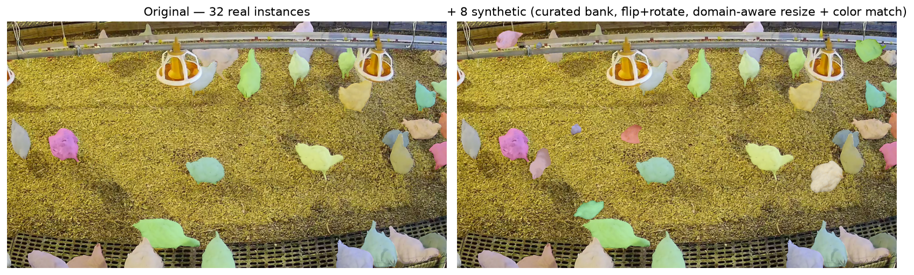
</p>

- **Curated donor bank** — filters out occluded or cut-off birds *before* caching, not after: mask/box area ratio ≥ 0.6 (below the dataset's own ~65% median occlusion, so it's not rejecting the typical instance) and an 80px border margin (quality over quantity — the candidate pool stays in the tens of thousands even that conservative, so there's no real cost to it). 500 instances cached as browsable PNG image + mask pairs — deliberately not `.npz`/COCO json/YOLO polygon labels, see [ADR 0014](docs/adr/0014-copy-paste-donor-bank-design.md) for why.

<p align="center">
  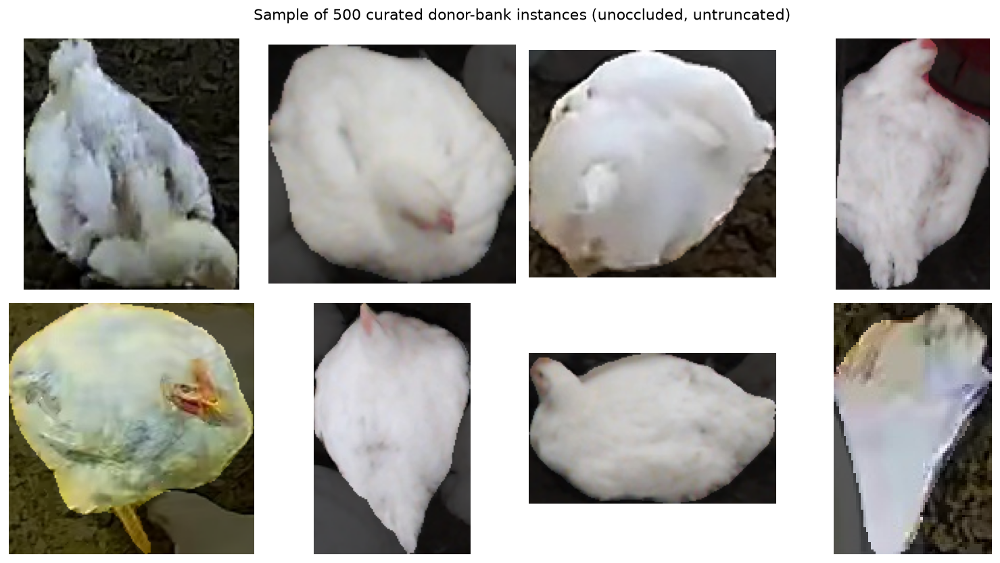
</p>

- **Overlap-aware placement** — rejection-sampled, so a paste doesn't just bury a bird that's already there.
- **Donor-side augmentation** — flip + full 360° rotation, since this is overhead imagery with no canonical "up" for a bird.
- **Domain-aware resize** — each pasted bird's size is drawn from *that scene's own* size distribution (mean + std), not a fixed range. Modeled directly on how a real flock's weight — and so apparent size — spreads out as it grows, rather than an arbitrary jitter.
- **Color-aware compositing** — a donor pulled from one ChickenVerse facility's lighting can carry a visibly different color cast than the target scene (spotted directly in an early raw, non-mask-overlaid version of the example above — several pasted birds read as obviously bluish/gray). Fixed with the same idea as the size fix: match each donor's LAB color statistics to the *target scene's own real birds* (mean + std of their actual pixels, not the background), a standard statistical color-transfer technique. Below: same scene, same 8 donors, same placements — the only difference is this one step.

<p align="center">
  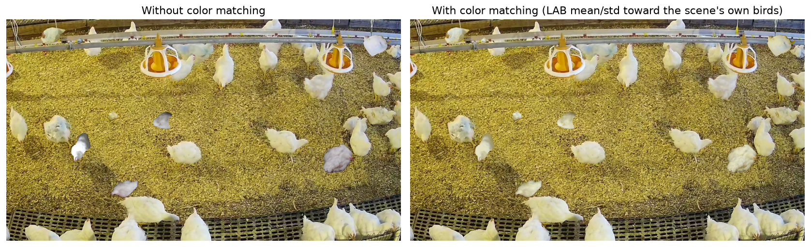
</p>

Notebook prototype only — not yet wired into `augmentation/segmentation.py` or an actual training run, per this project's own notebook-first workflow (constitution Principle II). Also fixed along the way: `ultralytics.data.converter.convert_coco` silently degrades ChickenDet's compressed-RLE masks to bbox-shaped rectangles unless preprocessed first — mean IoU against the real mask went from 0.63 to 0.97 once fixed (see [ADR 0013](docs/adr/0013-rle-to-polygon-preprocessing-for-yolo-seg-conversion.md)). Full design rationale for the resize and color fixes, including rejected alternatives, in [ADR 0014](docs/adr/0014-copy-paste-donor-bank-design.md)/[ADR 0015](docs/adr/0015-color-aware-donor-compositing.md).

## Portfolio Scope & Objectives

### Detection track — done

1. **Fine-tuned and hyperparameter-optimized a CNN-based detector (YOLO26)** to a genuinely strong result on a dense, occluded dataset: `yolo26n` now slightly *beats* ChickenVerse's own published baseline (`box_map50_95` +0.003) after a hyperparameter search, a domain-informed directional augmentation, and progressive unfreezing — see [Results](#results) for the numbers and [Training Configuration](#training-configuration) for how the two setups actually differ.
2. **Built a domain-specific augmentation strategy** for dense, small, occluded objects: Albumentations-based color-invariance, lighting, occlusion-simulation, and a directional (asymmetric) brightness/contrast transform — searched alongside Ultralytics' own hyperparameters, with a bounding-box-aware visualization CLI to eyeball the effect before committing to a search.
3. **Ran and documented negative results, not just wins**: test-time preprocessing, a full hyperparameter-search config, and `copy_paste_mode` A/B all came back flat-or-negative — kept and written up (ADR + README [Key Findings](#key-findings)) instead of quietly dropped, because knowing what *doesn't* help is part of the actual engineering record. The eventual win came from applying one of those failed ideas differently, not from abandoning it.

### Production practices demonstrated along the way

- **Task-separated, shared-utility package structure**: `src/poultry_monitoring/` — `data/`, `augmentation/`, `detection/` — each a small set of typed, docstringed functions, not one long script; a single CLI (`python -m poultry_monitoring.detection.yolo <command>`) drives tuning, training, progressive unfreezing, inference, and comparison runs.
- **Experiment tracking**: every tuning/training run logged to MLflow (params, per-epoch metrics, final val metrics, artifacts) — see [`CLAUDE.md`](CLAUDE.md) § MLflow Conventions for the schema.
- **Decision records**: 15 [ADRs](docs/adr/README.md) capturing non-obvious calls, several reached by testing an assumption and finding it wrong (e.g. why the augmentation search can't share Ultralytics' own tuner, why a promising-looking hyperparameter search still lost, or why `convert_coco` was silently producing bbox-shaped masks) rather than just asserting a conclusion.
- **Exploratory-then-productionized workflow**: notebooks establish that an approach works; `src/poultry_monitoring/` is the redesigned, tested, CLI-driven version — not a line-for-line port (constitution Principle II).
- **Test coverage scoped deliberately**: `pytest` smoke tests cover deterministic pipeline code (COCO parsing, augmentation shapes/behavior, hyperparameter routing) — not training convergence, which isn't a unit-testable property (constitution Principle VIII).
- **Governance sized to the project**: `constitution.md` + `plan.md` + `CLAUDE.md` — heavier than a single README, lighter than full spec-kit — see [Project Docs](#project-docs).

### Beyond detection — in progress / planned

4. Instance segmentation on the same dataset (YOLO26-seg), same tune/train/MLflow treatment as detection — Phase 3 in [`plan.md`](plan.md), now underway (`notebooks/03_explore_segmentation.ipynb`: mask quality, conversion fidelity, an augmentation prototyping sandbox, and a synthetic copy-paste data pipeline — see [Synthetic Copy-Paste Data Augmentation](#synthetic-copy-paste-data-augmentation)).
5. Hands-on practice with a transformer-based detector (DETR) as a secondary track — compared fairly against YOLO26 if/when both are far enough along, not a gating requirement.
6. A GPU-accelerated data loading pipeline (DALI vs. a standard loader), if profiling shows it's warranted.
7. Exporting and optimizing trained models (ONNX, TFLite/LiteRT) and comparing inference latency/throughput across targets.

## Project Docs

This project uses a hybrid workflow — heavier than a single `CLAUDE.md`, lighter than full spec-kit — see [`CLAUDE.md`](CLAUDE.md) § Workflow for why.

| Doc | What's in it |
|---|---|
| [`constitution.md`](constitution.md) | Non-negotiable-ish principles governing this project (code style, notebook-first workflow, benchmarking rigor, dataset licensing) |
| [`plan.md`](plan.md) | Phased roadmap and **live status** of every task — the first place to check for "where are we right now" |
| [`CLAUDE.md`](CLAUDE.md) | Concrete working conventions for Claude Code in this repo: package layout, MLflow schema, gate commands, CLI reference |
| [`docs/adr/`](docs/adr/README.md) | Architecture Decision Records — non-obvious design calls, especially ones reached by testing an assumption and finding it wrong |
| [Root `README.md`](../README.md) | How this project fits into the broader portfolio, and why different projects here use different workflow formalities |

## Status

🟡 **In progress.** Environment set up and GPU-verified (local + Colab); data exploration and YOLO26 baseline notebooks done; `src/poultry_monitoring/` productionized with a working train/tune/augtune/unfreeze/sweep/predict/ttp CLI. **Detection (Phase 2) is done**: `yolo26n` is fully trained through progressive unfreezing and now slightly beats ChickenVerse's published baseline (see [Results](#results)); `yolo26s` is trained but hasn't had the same unfreezing/directional-augmentation treatment yet — queued, not a blocker. Segmentation (Phase 3) is now the active phase, starting from `notebooks/03_explore_segmentation.ipynb`. See [`plan.md`](plan.md) for phase-by-phase status and the [root repository README](../README.md) for how this project fits into the broader portfolio.
