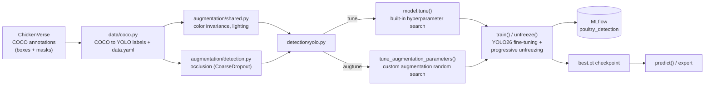

# Poultry Monitoring: Object Detection & Instance Segmentation

Detecting and segmenting individual chickens in dense, overhead poultry farm imagery — a portfolio project applying modern object detection and segmentation architectures to an industrial computer vision problem. **YOLO26 is the primary deliverable**; a DETR track exists as separate practice with transformer architectures, not a gating comparison (see [`CLAUDE.md`](CLAUDE.md) § Project Intent).

**Status:** 🟡 In progress — `yolo26n` tuned, trained, and progressively unfrozen (val mAP50 = 0.987, mAP50-95 = 0.892), now **ahead of** ChickenVerse's own published baseline; `yolo26s` training running now. See [Status](#status) for the full picture and [`plan.md`](plan.md) for the live phase-by-phase roadmap.

## Table of Contents

- [Dataset](#dataset)
- [Industrial Applications & Real-World Challenges](#industrial-applications--real-world-challenges)
- [Tech Stack](#tech-stack)
- [Architecture](#architecture)
- [Usage](#usage)
- [Results](#results)
- [Portfolio Scope & Objectives](#portfolio-scope--objectives)
- [Project Docs](#project-docs)
- [Status](#status)

## Dataset

[**ChickenVerse**](https://github.com/amirivojdan/ChickenVerse) (ChickenDet subset), via [Zenodo](https://zenodo.org/records/20672799):

- 6,539 overhead-view images from 5 poultry facilities
- 153,764 annotated chicken instances (~23.5 per image on average, up to 50+ in the test split)
- COCO-format annotations with both bounding boxes and pixel-level segmentation masks
- Pre-split into train / validation / test sets

### License

ChickenVerse is released under **CC BY-NC-SA 4.0** (Attribution-NonCommercial-ShareAlike). It is used here strictly for **non-commercial, educational/portfolio purposes**, with attribution to the original authors. Any derivative work or adaptation must be shared under the same license.

## Industrial Applications & Real-World Challenges

Automated visual monitoring of poultry flocks has direct relevance to precision livestock farming:

- **Flock counting** — automated headcounts without manual inspection
- **Density & welfare monitoring** — detecting overcrowding or abnormal distribution, an early welfare indicator
- **Behavioral analysis** — time spent near feeders and water outlets, and time spent walking, laying, or standing, as activity/welfare indicators
- **Automated inspection** — surfacing anomalies (e.g. isolated or motionless birds) from continuous camera feeds
- **Scalable monitoring** — replacing manual, spot-check inspection with continuous, camera-based coverage across facilities

A production system for this problem has to hold up against conditions this dataset won't necessarily cover on its own: varying litter color/composition, inconsistent lighting between facilities and times of day, differing camera distance/angle across installations, and birds changing in size and appearance as a flock ages. Worth keeping in mind when interpreting results and generalizing beyond this dataset.

**Future work:** the detection/segmentation output is the foundation for a small analytics dashboard — extracting per-video metrics (counts, density over time, feeder/water-outlet dwell time, behavior breakdowns) from farm house footage. See [`plan.md`](plan.md) § Future Work for the full backlog.

## Tech Stack

- **[Ultralytics YOLO26](https://docs.ultralytics.com/)** — real-time, anchor-free/NMS-free CNN detector and segmenter; the model this project actually productionizes
- **[Albumentations](https://albumentations.ai/)** — custom domain-specific augmentation (color invariance, lighting/contrast, occlusion simulation), chosen over DALI for augmentation specifically — richer transform set, no GPU-memory contention with training
- **[NVIDIA DALI](https://developer.nvidia.com/dali)** — GPU-accelerated data *loading*, evaluated later only if profiling shows it's the actual bottleneck
- **[MLflow](https://mlflow.org/)** — experiment tracking (local SQLite store), via Ultralytics' native integration
- **[DETR](https://huggingface.co/docs/transformers/model_doc/detr)** (Hugging Face `transformers`) — transformer-based, set-prediction detector/segmenter; a secondary practice track, not gating the above
- **[ONNX Runtime](https://onnxruntime.ai/)** and **[TensorFlow Lite / LiteRT](https://ai.google.dev/edge/litert)** — model export and optimization for deployment
- **PyTorch** as the underlying training framework

## Architecture



Custom augmentation search runs separately from `model.tune()` because Ultralytics' tuner executes each trial as its own subprocess, which can't carry live Python objects like a custom Albumentations transform list — see [ADR 0001](docs/adr/0001-custom-augmentation-search-separate-from-tuner.md). Both search results feed into `train()`, which fine-tunes a checkpoint, validates the best epoch, and logs everything to MLflow via [ADR 0003](docs/adr/0003-native-mlflow-integration.md)'s native integration.

Full package layout (module-by-module, including the not-yet-built segmentation/DALI/export pieces) lives in [`CLAUDE.md`](CLAUDE.md) § Package Layout — this diagram covers the detection path that's actually implemented today.

## Usage

```bash
uv sync --extra dev   # installs deps incl. jupyter/torchinfo; verify torch.cuda.is_available()
```

Everything below runs through `detection/yolo.py`'s CLI (`--data-dir` points at a ChickenDet
root containing `images/` and `annotations/`):

```bash
# Hyperparameter search on yolo26n (Ultralytics' native genetic-algorithm tuner)
uv run python -m poultry_monitoring.detection.yolo tune --data-dir data/ChickenDet \
    --iterations 20 --epochs 15 --fraction 0.3

# Custom Albumentations parameter search (color invariance, lighting/contrast, occlusion)
uv run python -m poultry_monitoring.detection.yolo augtune --data-dir data/ChickenDet \
    --trials 8 --epochs 15 --fraction 0.3

# Fine-tune one size with fixed hyperparameters (e.g. a winning tune/augtune result)
uv run python -m poultry_monitoring.detection.yolo train --data-dir data/ChickenDet \
    --model-name yolo26n --variant tuned --epochs 300 --patience 15 \
    --hyperparameters-json '{"lr0": 0.01, "fliplr": 0.5, "p_lighting": 0.12}'

# Progressive-unfreezing refinement on top of an already-trained checkpoint: three stages of
# decreasing freeze (10 -> 5 -> 0) and decreasing lr0 (5e-4 -> 1e-4 -> 2e-5), each continuing
# from the previous stage's best weights — see DEFAULT_UNFREEZE_STAGES in detection/yolo.py
uv run python -m poultry_monitoring.detection.yolo unfreeze --data-dir data/ChickenDet \
    --model-name yolo26n --initial-weights data/ChickenDet/YOLO/yolo26n-tuned/weights/best.pt \
    --hyperparameters-json '{"lr0": 0.01, "fliplr": 0.5, "p_lighting": 0.12}'

# Full pipeline: tune, then train every size in --sizes with the winning config
uv run python -m poultry_monitoring.detection.yolo sweep --data-dir data/ChickenDet \
    --sizes n s --train-epochs 300 --train-patience 15

# Inference on your own images with a trained checkpoint
uv run python -m poultry_monitoring.detection.yolo predict \
    --weights data/ChickenDet/YOLO/yolo26n-tuned/weights/best.pt \
    --source path/to/image_or_directory --conf 0.36 --save-dir predictions/
```

**Visualize what the custom augmentations actually do** to a sample image (and its boxes,
if a label file is given) before committing to a search over their parameters — pure
Albumentations/numpy, no GPU needed, so it's safe to run alongside a live GPU training job
(unlike everything above, which all touch torch):

```bash
uv run python -m poultry_monitoring.augmentation.visualize \
    --image data/ChickenDet/images/Train/<file>.jpeg \
    --label data/ChickenDet/labels/Train/<file>.txt \
    --shared p_color_invariance=1.0 p_lighting=1.0 \
    --detection p_occlusion=1.0 \
    --n-samples 6 --save augmentation_preview.png
```

`--shared`/`--detection` are `key=value` overrides for `augmentation/shared.py` (color
invariance, lighting/contrast) and `augmentation/detection.py` (occlusion simulation via
`CoarseDropout`) respectively — omit `--save` to open an interactive window instead.

**Experiment tracking** — every `train`/`unfreeze`/`sweep` run logs params, per-epoch
metrics, and final `box_map50`/`box_map50_95`/`box_precision`/`box_recall` to MLflow under
the `poultry_detection` experiment:

```bash
uv run mlflow ui --backend-store-uri sqlite:///mlflow.db
```

Export/benchmark CLI entry points don't exist yet — Phase 6 in [`plan.md`](plan.md).

## Results

| Model | Split | Precision | Recall | mAP50 | mAP50-95 | Notes |
|---|---|---|---|---|---|---|
| `yolo26n` (this project) | val | 0.965 | 0.953 | **0.987** | **0.892** | Tuned hyperparameters + custom augmentation + progressive unfreezing (3 stages, `freeze` 10→5→0), full dataset. |
| `yolo26n` (ChickenVerse published) | val | — | — | 0.987 | 0.890 | Reference baseline, same architecture/scale — **we're now ahead on both columns.** |
| `yolo26s` (this project) | val | — | — | — | — | Training running now, same tuned config. |
| `yolo26s` (ChickenVerse published) | val | — | — | 0.990 | 0.919 | Reference baseline. |

All numbers are validation-split metrics from an explicit `model.val()` pass after training (not training-loop numbers). ChickenVerse's own benchmark table reports two separate mAP columns — only the `val_mAP50`/`val_mAP50-95` ones are comparable to the numbers above; see [`plan.md`](plan.md) Phase 2 for the full note. **The test split is intentionally not used for any comparison or tuning decision**, to avoid implicitly fitting it.

This table reflects the state as of the last update — [`plan.md`](plan.md) Phase 2 is the live source of truth while the unfreezing/`yolo26s` runs are in flight.

## Portfolio Scope & Objectives

This project is scoped to demonstrate:

1. Fine-tuning and hyperparameter-optimizing a CNN-based detector (YOLO26) to a genuinely strong result on a dense, occluded dataset — the primary deliverable
2. A domain-specific augmentation strategy suited to dense, small, occluded objects (Albumentations, searched alongside hyperparameters)
3. Hands-on practice with a transformer-based detector (DETR) as a secondary track — compared fairly against YOLO26 if/when both are far enough along, not a gating requirement
4. Building and benchmarking a GPU-accelerated data loading pipeline (DALI vs. a standard loader), if profiling shows it's warranted
5. Exporting and optimizing trained models (ONNX, TFLite/LiteRT) and comparing inference latency/throughput across targets

## Project Docs

This project uses a hybrid workflow — heavier than a single `CLAUDE.md`, lighter than full spec-kit — see [`CLAUDE.md`](CLAUDE.md) § Workflow for why.

| Doc | What's in it |
|---|---|
| [`constitution.md`](constitution.md) | Non-negotiable-ish principles governing this project (code style, notebook-first workflow, benchmarking rigor, dataset licensing) |
| [`plan.md`](plan.md) | Phased roadmap and **live status** of every task — the first place to check for "where are we right now" |
| [`CLAUDE.md`](CLAUDE.md) | Concrete working conventions for Claude Code in this repo: package layout, MLflow schema, gate commands, CLI reference |
| [`docs/adr/`](docs/adr/README.md) | Architecture Decision Records — non-obvious design calls, especially ones reached by testing an assumption and finding it wrong |
| [Root `README.md`](../README.md) | How this project fits into the broader portfolio, and why different projects here use different workflow formalities |

## Status

🟡 **In progress.** Environment set up and GPU-verified (local + Colab); data exploration and YOLO26 baseline notebooks done; `src/poultry_monitoring/` productionized with a working train/tune/augtune/unfreeze/sweep/predict/ttp CLI. `yolo26n` is fully trained through progressive unfreezing and now beats ChickenVerse's published baseline (see [Results](#results)); `yolo26s` training is running now, followed by a `copy_paste_mode` A/B test, a test-time-preprocessing comparison, and a `multi_scale` hyperparameter re-tune. See [`plan.md`](plan.md) for phase-by-phase status and the [root repository README](../README.md) for how this project fits into the broader portfolio.
