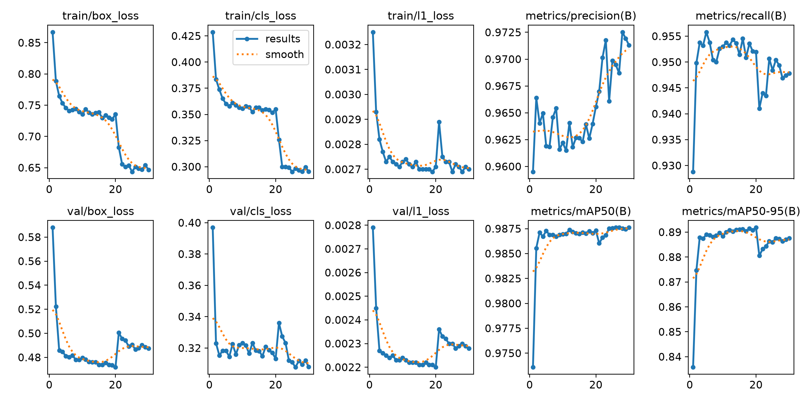

# Engineering Notes

Findings worth keeping visible, including the ones that didn't work. The
[ADRs](adr/README.md) hold the decisions and rejected alternatives; this file holds the
empirical results behind them. The [README](../README.md) links here rather than carrying
this level of detail.

## Detection track

- **Ultralytics' genetic tuner doesn't meaningfully explore from a fixed starting point**
  ([ADR 0005](adr/0005-genetic-tuner-undersearches-from-a-fixed-start.md)) — caught
  mid-run: a follow-up `multi_scale` search (range `0.0`–`0.3`) never sampled anything
  past `~1e-4`. Traced to the tuner's source: mutation is purely *multiplicative* from the
  current population, and when that population has no real diversity yet (true for every
  parameter on iteration 2, since iteration 1 is always unmutated defaults), the crossover
  step's fallback only injects a tiny random nudge — never a meaningful jump across a wide
  range. The uncomfortable implication: the *original* built-in-augmentation search likely
  had the same problem — its winning "iteration 1" was literally unmutated defaults, never
  beaten across 20 iterations. **Fixed**: `tune_hyperparameters` now runs Optuna's TPE
  sampler instead, unified with the custom Albumentations search into one joint pass.

- **A "successful" 40-trial search turned out to be silent garbage**
  ([ADR 0007](adr/0007-subprocess-per-optuna-trial.md), later reverted by
  [ADR 0009](adr/0009-revert-to-in-process-optuna-trials.md)) — exit code 0, a printed
  "best" result, all 40 trials nominally complete. In reality, trials 3-39 each failed in
  ~1.3 seconds (far too fast to train anything) and were silently scored `0.0` by an overly
  broad exception handler with no logging. Root cause, found through live process/memory
  monitoring rather than guessing: running 40 real training calls in one long-lived Python
  process orphans DataLoader **worker processes** (Windows `spawn`-based multiprocessing)
  that accumulate across trials and exhaust system RAM — not GPU VRAM, which a first fix
  attempt (`torch.cuda.empty_cache()`) wrongly targeted. `workers=0` confirmed the
  mechanism by eliminating it entirely (no leak, but ~5-6x slower); `workers=4` still
  leaked, just slower. **Fixed** at the time by running each trial as its own subprocess;
  **later reverted** in favor of a plain in-process Optuna objective for a simpler
  main script, deliberately re-accepting this risk rather than re-solving it.

- **Test-time preprocessing doesn't help**
  ([ADR 0004](adr/0004-no-test-time-preprocessing.md)) — autocontrast/CLAHE/histogram-
  equalization applied only at inference (no retraining) on a trained checkpoint were
  flat-to-negative: autocontrast was a wash (≤0.001 on every metric — the model already saw
  similarly mild autocontrast during training), while CLAHE and histogram-equalization
  measurably hurt (−0.013 to −0.014 mAP50-95) by creating a train/inference distribution
  mismatch instead of correcting one.

- **`close_mosaic` must scale with stage length**, not get inherited from a different run's
  tune result — reusing `close_mosaic=10` (sized for a 300-epoch run) unchanged on 30-epoch
  progressive-unfreezing stages disabled mosaic for the last third of each stage, visible
  below as a sharp train-loss drop plus a transient val-loss/mAP50-95 dip right at epoch 20
  (mosaic switches off at `epoch == epochs - close_mosaic`). Fixed with two rules of thumb:
  `epochs >> close_mosaic`, and `patience < close_mosaic` (since Ultralytics' `best.pt`
  always tracks the best-ever-observed fitness regardless of when training stops, a shorter
  patience bounds how much of a bad post-transition regime gets trained through before
  reverting).

  

- **`AutoContrast`'s cutoff needed to vary per-application**, not get tuned to one fixed
  value — Albumentations' `RandomBrightnessContrast` auto-symmetrizes a tuned scalar into a
  fresh `±range` every call, but `AutoContrast.cutoff` doesn't have that built in; the
  augmentation search had converged it to a single always-identical value. Fixed with a
  small subclass that resamples `cutoff` from a fixed range each application instead.

- **`copy_paste_mode` (`"flip"` vs `"mixup"`) is a wash at proxy scale** — every metric
  within 0.006 between the two; not a meaningful lever for this dataset as tested, despite a
  real theoretical scale-mismatch risk for `"mixup"` (unmatched cutout/background scale)
  that didn't clearly show up in the numbers either.

- **A conservative, hand-curated search space still found a losing config**
  ([ADR 0008](adr/0008-conservative-hyperparameter-space.md),
  [ADR 0011](adr/0011-conservative-search-result-not-adopted.md)) — narrowing the search
  space (down from a near-copy of Ultralytics' own wide `Tuner.space`) didn't guarantee a
  winner. A real 16-trial run's best trial, applied at full scale, underperformed the
  pre-session baseline in *both* cold-start (`Δ −0.0286` mAP50-95) and warm-start
  (`Δ −0.0169`) regimes — confirmed via matched-config re-runs, not a one-off. The
  cold-start run's per-epoch curve converged completely normally (no instability); it simply
  plateaued at a genuinely worse optimum. Not adopted.

- **Third time was the charm for the "birds are white, background is dark litter" idea**
  ([ADR 0012](adr/0012-directional-brightness-contrast-augmentation.md)) — two earlier
  attempts at the same observation both failed: a fixed test-time-only transform (entry
  above), and via the ADR 0011 search. What worked was applying it as an *asymmetric,
  training-time* augmentation instead — `RandomBrightnessContrast` with
  `brightness_limit=(-0.35,-0.05)`, `contrast_limit=(0.3,0.7)` (always darken, always boost
  contrast, but still resampled per call) — needing zero new code, since Albumentations
  already accepts asymmetric-tuple limits. Behind the baseline through the first two
  unfreeze stages, only overtaking once the whole backbone is trainable:
  `box_map50_95=0.8929` vs. the prior best `0.8919` (`Δ +0.0010`), `precision +0.0058`,
  `recall −0.0040`. Modest, but the first configuration to beat the baseline end-to-end, and
  now the adopted `yolo26n` config.

## Segmentation & synthetic copy-paste

- **`convert_coco` silently degrades RLE masks to bounding boxes**
  ([ADR 0013](adr/0013-rle-to-polygon-preprocessing-for-yolo-seg-conversion.md)) —
  Ultralytics' converter can't read compressed RLE and substitutes a box-shaped segment
  without warning. ChickenDet ships 100% RLE, so every `-seg` label was effectively box-only:
  mean mask IoU 0.63 vs. 0.97 once RLE is converted to polygons first.

- **Only one viable hook exists for training-time copy-paste**
  ([ADR 0017](adr/0017-training-time-copy-paste-augmentation.md)) — the obvious candidates
  all fail. A custom Albumentations transform *cannot* work: Ultralytics' wrapper only maps
  existing instances and filters them by index, so it can't append one. A custom DataLoader
  is the wrong layer: `BaseDataset.__getitem__` is
  `self.transforms(self.get_image_and_label(index))`, so a loader only ever sees
  already-transformed samples. And injecting from a callback would have been **silently**
  broken — `close_mosaic` rebuilds the transform chain mid-training and would have dropped
  the transform for the final epochs with no error.

- **Polygon-native compositing is 8.7–15.5× faster than mask-per-instance** — measured on a
  640×640 canvas: 106 ms → 12.3 ms at 50 instances, 434 ms → 27.9 ms at 200 (mosaic scale).
  The naive version would have made the dataloader the bottleneck. Profiling then showed
  donor disk I/O was 47% of what remained (~9 ms/read vs. ~0.01 ms cached; warming the OS
  page cache does not help on Windows), fixed by giving each worker a fully-cached random
  slice of the bank.

- **Three bugs found while building it**, two of the silent-corruption kind:
  1. `cv2.fillPoly` applies an **even-odd winding rule across contours** — passing several
     overlapping polygons in one call punches a *hole* where they overlap (480 px vs. 651
     looped). On dense frames that would mark the most crowded regions as free space for
     placement and drop them from the colour statistics.
  2. Importing `ultralytics` **monkeypatches `cv2.imread` globally** to "always ensure 3
     dimensions", so `IMREAD_GRAYSCALE` returns `(H, W, 1)` instead of `(H, W)`. Only
     reproduces once ultralytics is imported.
  3. The donor bank's raw COCO `category_id` reached the loss as an out-of-range class,
     surfacing as an opaque CUDA device-side assert. **Caught only by an end-to-end smoke
     run** — the unit-test fixture had pre-remapped the ids, so the tests were blind to it.

- **An `epochs` cap you never reach can still change the optimizer**
  ([ADR 0018](adr/0018-pin-segmentation-optimizer.md)) — `optimizer="auto"` selects on an
  iteration count computed against `nbs` (64) rather than `batch`, so `ceil(5219/64) * epochs`
  crosses its 10k threshold at `epochs > 122` on ChickenDet whether or not those epochs run.
  Two copy-paste ablation arms differing *only* in their cap (200 vs. 100) therefore trained
  on different optimizers — MuSGD at `lr0=0.01` vs. AdamW at `lr0=0.002`, ~20–40× apart.
  `auto` also overrides `lr0`/`momentum`/`warmup_bias_lr` without writing them back, so
  neither run's `args.yaml` described what actually trained; the optimizer had to be recovered
  from the logged per-group LR traces (8 groups = MuSGD, 3 = AdamW).

- **Screening every delta against a noise floor removes most of the apparent
  scenario-dependence.** The ablation superficially looks like "copy-paste helps in some
  situations and hurts in others" — it improves some metrics on validation and different
  ones on test. Screening all 18 size × metric × split combinations against the measured
  per-epoch noise (worst swing over the last 20 epochs: **0.54 pp box, 0.81 pp mask**)
  leaves only three that are both consistent in sign across splits *and* above that floor:

  | | validation | test | |
  |---|---|---|---|
  | `yolo26n-seg` box mAP50-95 | +1.19 | +1.67 | stable **+** |
  | `yolo26n-seg` box precision | +0.87 | +1.31 | stable **+** |
  | `yolo26s-seg` box mAP50-95 | −0.72 | −0.90 | stable **−** |

  Everything else flips sign between splits or sits under the floor — recall flips at both
  sizes, mask mAP50-95 flips at both sizes, mask mAP75 flips at both. Those are precisely
  the metrics that created the "mixed results" impression. The real finding is narrower and
  firmer: **copy-paste has one measurable effect, box localization, positive on `n` and
  negative on `s`, holding across two splits whose densities differ by 1.8×.**

- **The effect scales with scene density — and a difference-of-differences got its sign
  wrong.** Splitting the test split into equal-size terciles by each image's own bird count
  (~83 images per bin) and re-scoring every checkpoint gives two clean monotonic trends in
  box mAP50-95, in opposite directions:

  | copy-paste minus baseline | sparse (~36 birds) | medium (~48) | dense (~68) |
  |---|---|---|---|
  | `yolo26n-seg` | +1.21 | +1.88 | **+2.01** |
  | `yolo26s-seg` | +0.22 | −0.23 | **−2.30** |

  A monotonic trend across three independent bins is far better evidence than any single
  delta, and it tests the mechanism's actual prediction rather than a proxy. It also
  **retracts** an earlier claim in this file: the validation→test gap in mask mAP50-95 shrank
  by +0.82 pp on `n` and +0.83 pp on `s`, which was written up as "copy-paste buys density
  robustness at both sizes." Measured directly, `s` degrades *more* in dense scenes, not
  less — the composite gave the opposite sign to the truth. Why: the gap is
  `test_delta − val_delta`, a rearrangement of two numbers already reported that adds no
  information while adding variance, and both mask deltas were inside the noise floor and
  happened to straddle zero the same way at both sizes, manufacturing an apparent +0.8 pp
  effect with matching magnitudes. It is an *interaction* term, which needs more samples than
  a main effect, not fewer. **Lesson: when a headline number is a difference of noisy
  differences, stratify and measure the thing directly instead.**

- **What the augmentation can and cannot teach, given where donors come from** — the bank is
  built from the whole Train split, which spans several facilities and 9 resolutions, so a
  paste really can drop a bird from one facility into another's scene. But every donor is
  still *inside* the training distribution — nothing genuinely unseen enters — and
  [ADR 0015](adr/0015-color-aware-donor-compositing.md)'s LAB matching deliberately damps the
  cross-facility appearance difference by matching each donor to the target scene's own
  birds. The pipeline therefore suppresses most of the appearance diversity it could have
  contributed, in exchange for not looking wrong. What is left is density and occlusion,
  which is exactly the shape of the results: box localization moves (it teaches *where birds
  are*, and the `n` gain grows with evaluation density, +1.19 at median 27 birds/img →
  +1.67 at median 48), while mask quality does not (a pasted donor is a clean cutout with no
  contact shadow, so there is no boundary signal to learn). Raising mask mAP is a
  compositing-realism problem; raising box mAP in crowded scenes is what this pipeline does.

- **The ablation asked the least favourable question of it** — "does synthetic data help when
  5,219 fully-labeled real images already exist?" is the case where it has least to add. The
  pipeline's stated purpose is cold-start at a new site with unlabeled frames and no masks,
  where it is not competing with real data but *is* the data; nothing here measures that.
  Two further biases point the same way: the validation split used for every decision has
  median density 27 (max 36) and so barely contains the regime the augmentation targets, and
  the `s` arms ran at one paste strength (`p=0.5`, up to 10 donors) that was never
  dose-swept. Read the modest numbers as a floor, not a verdict.

- **Copy-paste's effect flips sign with model size** — on matched optimizers, box mAP50-95
  goes **+1.19 pp on `yolo26n-seg` but −0.72 pp on `yolo26s-seg`**, and both directions
  reproduce on the held-out test split (+1.67 / −0.90). Stopping behaviour agrees: on `n`
  copy-paste trained ~2× longer before plateauing (75 epochs vs. 38), on `s` it stopped
  *earlier* (41 vs. 65), i.e. the extra data stopped yielding signal sooner. (An earlier
  version of this note cited box recall as corroboration — don't; recall flips sign between
  validation and test at both sizes and is inside the noise floor.) Capacity is the plausible
  reading — `n` is capacity-limited here and extra instances help, while `s` fits the real
  distribution well enough that compositing artifacts cost more than added density is worth —
  but it is **not demonstrated**: `n` ran at batch 16 and `s` at batch 8 (the `s` model plus
  the donor-bank trainer OOMs an 8 GB card), so model size co-varies with batch size across
  the two ablations. Re-running `n` at batch 8 would separate them. Either way it stands as a
  reminder that an augmentation validated on one model size does not transfer to a larger one
  for free.

- **The validation split is the easy one, and it flatters every result by ~12 points** — median
  density is 27 birds/image on Validation vs. **48 on Test**, and Validation's *densest* frame
  (36) sits below Test's *median*. Test is also a single camera at 1280×720, a resolution
  Validation never contains. Every segmentation checkpoint loses 11–13 pp of box and mask
  mAP50-95 crossing over. Not overfitting — a split-construction artifact, and the reason the
  test figures are the better estimate for a crowded real scene. The copy-paste sign flip
  reproduces there (box mAP50-95 +1.66 on `n`, −0.90 on `s`), with the `n` gain *larger* on the
  denser split, and copy-paste narrows the val→test mask gap at both sizes.

- **Repeated `model.val()` in one process hangs on Windows with default workers** — evaluating
  five checkpoints in a loop stalled indefinitely on the first one (>25 min, no output, no
  progress on disk). `workers=0` ran all five in under a minute. Same family as
  [ADR 0007](adr/0007-subprocess-per-optuna-trial.md)'s Windows `spawn` DataLoader trouble;
  parallel loading buys nothing on a 250-image split anyway.

- **Mask mAP50-95 is too noisy here to read small deltas** — it swings **0.2–0.8 pp between
  adjacent epochs** within a single run (0.95–2.82 pp of spread over the last 20 epochs),
  while box mAP50-95 moves only 0.1–0.5 pp/epoch and climbs near-monotonically. Any mask
  conclusion below ~1 pp is inside its own run's noise band; an earlier read of "mask mAP75
  −0.63 shows copy-paste doesn't improve boundaries" did not survive this check. Also why
  `best.pt` can sit at a surprising epoch — Ultralytics selects on a combined box+mask
  fitness, so the `yolo26s-seg` baseline kept training to epoch 65 while its best *mask*
  mAP50-95 had occurred at epoch 8.

- **Continuing a converged run with mosaic off didn't help** — the copy-paste run early-stopped
  at epoch 75 of a 100-epoch cap, so `close_mosaic=10`'s mosaic-free final phase (due at epoch
  91) never ran. Restarting from its `best.pt` for 25 mosaic-free epochs (`lr0=0.0007`, no
  warmup, same donor bank and paste strength) regressed 8 of 9 metrics — only `box_map50_95`
  improved (+0.45 pp), against `mask_map75 −0.75` and `mask_map50_95 −0.39`. Per-epoch mask
  mAP50-95 never once beat the 0.8356 it inherited across all 25 epochs (best 0.834, epoch 8).
  Read as: the model was already converged, and restarting the LR schedule and optimizer state
  cost more than the cleaner mosaic-free distribution bought.

- **Prior art, stated plainly** — the augmentation is an engineering contribution, not a new
  technique. Copy-paste for instance segmentation is
  [Ghiasi et al., CVPR 2021](https://arxiv.org/abs/2012.07177); statistical colour transfer
  is Reinhard et al. (2001); scale-aware placement and local colour adaptation both have
  precedent ([CACP](https://arxiv.org/html/2407.08151v2),
  [Traffic Context-Aware Augmentation](https://arxiv.org/pdf/2205.00376)). What's specific
  here is the domain parameterization: fitting pasted-instance size to the target scene's
  own instance-size distribution on flock-ageing grounds, rather than deriving it from depth
  or perspective.
