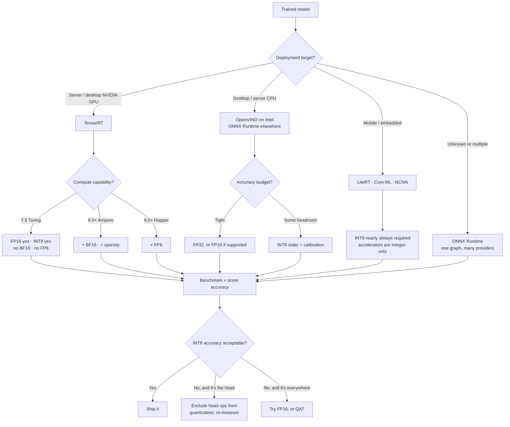

# Model Export & Optimization Playbook

A reusable procedure for taking a trained vision model and answering two questions
honestly: **what does it cost to run**, and **what does making it cheaper cost in
accuracy**.

Written to be project-agnostic — nothing here depends on poultry, YOLO, or Ultralytics.
The concrete findings from this repo's own pass live in
[ADR 0020](adr/0020-export-quantization-matrix.md); this document is the part that
transfers.

Assumes no prior knowledge of quantization.

---

## 1. Concepts, plainly

### Precision

A trained network stores its weights as 32-bit floats (**FP32**). Two cheaper formats:

- **FP16** — 16-bit float. Half the memory, and modern GPUs have dedicated hardware for
  it. Range is much narrower than FP32, so values can overflow to infinity or underflow to
  zero, but for inference this is usually safe.
- **INT8** — 8-bit *integer*. A quarter the memory, and integer arithmetic is much faster.
  But integers can't represent 0.001 and 500.0 in the same scheme, which is where all the
  difficulty comes from.

Also worth knowing: **BF16** trades precision for FP32's range, and **FP8** exists on the
newest hardware. Both need Ampere-or-newer / Hopper respectively — check before planning
around them.

### How INT8 actually works

INT8 stores 256 distinct values. To represent real activations you pick a **scale** (and
sometimes a **zero-point**) per tensor:

```
real_value  ≈  scale × (int8_value − zero_point)
```

Choosing `scale` means knowing the range of values that tensor actually takes. That's the
entire game — and it's why the next distinction matters.

### Dynamic vs. static quantization

|  | Dynamic (weight-only) | Static (full) |
|---|---|---|
| Weights | INT8 | INT8 |
| Activations | stay FP32 | INT8 |
| Needs calibration data? | **No** | **Yes** |
| Typical speedup | small, sometimes negative | large |
| Typical accuracy cost | very small | small but real |

**Dynamic** quantizes only the weights, computing activation ranges on the fly. It needs no
data, which makes it tempting — but on convolution-heavy networks it is frequently *slower
than FP32*, because every weight must be dequantized on each forward pass while the actual
arithmetic stays in float. Measure it; don't assume it helps.

**Static** observes real activation ranges by running a few hundred representative inputs
through the network (**calibration**), then bakes fixed scales in. This is where the real
speedup lives.

**PTQ vs. QAT**: everything above is *post-training quantization* — applied to an already
trained model. *Quantization-aware training* simulates quantization during training so the
model learns to tolerate it. QAT recovers more accuracy but requires retraining; try PTQ
first, and only reach for QAT if PTQ's accuracy loss is unacceptable.

### QDQ nodes

Static quantization is usually expressed by inserting **Quantize** and **DeQuantize** nodes
around each operation in the graph. The runtime then fuses `DQ → Op → Q` sequences into a
single INT8 kernel. If you inspect a "quantized" graph and see float operations, that's
often just un-fused QDQ, not a failure.

### Which ops stay float — the decision that decides whether INT8 works

**This is the single most important thing in this document.**

A quantization scale covers one tensor's whole range. If a tensor mixes wildly different
magnitudes, one scale cannot serve both, and the small values get crushed to zero.

Detection heads are the canonical example: the output tensor holds box coordinates in
pixels (0–640) *next to* class probabilities (0–1). One shared scale sized for 640 gives a
step size far larger than any probability, so **every confidence score rounds to zero** and
the model detects nothing. The model isn't broken; the quantization scheme is.

The fix is to quantize only the weighted operations — `Conv`, `Gemm`, `MatMul` — and leave
the head's decode arithmetic in float. Mature toolchains do this for you; if you write the
quantization call yourself, you must do it explicitly. A quantized detector that returns
zero detections almost always means the head got quantized.

### Backends and execution providers

The **runtime** executes the graph. ONNX Runtime is one runtime with several **execution
providers** (CPU, CUDA, TensorRT). OpenVINO and TensorRT are separate runtimes. Same
weights, different machine code — and different numerics, so accuracy can shift slightly
between backends even at identical precision.

---

## 2. Decision map

Start from where the model will run, not from what's interesting to try.



**Rules of thumb**

- FP16 on a GPU with FP16 hardware is nearly free — usually the first thing to try, often
  ~2x with negligible accuracy change.
- INT8 pays off most on CPU and on edge accelerators.
- A larger model quantized often beats a smaller model at FP32, at the same latency. Test
  that comparison — it's frequently the actual answer.
- Batching raises throughput and *worsens* per-image latency. Know which you're optimizing.

---

## 3. The procedure

### Step 0 — Decide what you're optimizing

Latency (one image, as fast as possible) and throughput (many images per second) pull in
opposite directions. Write down the target and the accuracy floor **before** measuring, so
results aren't rationalized after the fact.

### Step 1 — Export at FP32 and verify parity

Before any quantization, confirm the exported graph is the same model. Run both on the same
inputs and compare outputs, then compare a real metric on a held-out sample.

If they differ, **stop and find out why**. Do not proceed to quantization with an unexplained
gap — you will spend the rest of the exercise attributing it to the wrong cause. See §5.2.

### Step 2 — Quantize

FP16 first (cheap, usually harmless). Then static INT8 with calibration data drawn from the
real distribution — a few hundred representative images is plenty. Calibration needs to
cover the *range* of activations, not be statistically representative of the whole dataset.

### Step 3 — Measure accuracy, against a shape-matched baseline

Score every artifact on a held-out split. Report the **delta** from the FP32 baseline, not
just absolutes.

> **The invariant that keeps this honest:**
> **accuracy is a property of the artifact; latency is a property of (artifact × device × batch).**

An INT8 graph has the same accuracy wherever it runs, so score each artifact **once** per
split, then sweep devices and batch sizes for latency only. This turns a combinatorial
matrix into a manageable one.

### Step 4 — Benchmark latency

- Discard warmup iterations. The first call pays for lazy graph construction, CUDA context
  creation, cuDNN algorithm selection and TensorRT tactic setup.
- Average over many iterations; report mean, median and p95. A large mean-median gap means
  something is stalling.
- **Synchronize on GPU.** CUDA work is queued asynchronously — without a synchronize you
  are timing how long it took to *launch* the kernel, not to run it. This mistake makes
  GPUs look absurdly fast.
- Measure **both** the raw forward pass and end-to-end (preprocess + inference +
  postprocess). If postprocessing is expensive — mask assembly, NMS — quantization may
  barely move end-to-end even while halving the forward pass. Reporting only one number
  misleads in one direction or the other.
- Pin and disclose CPU thread counts; unpinned, CPU numbers aren't reproducible.

### Step 5 — Report

See §6.

---

## 4. Keeping the artifacts straight

A modest matrix — 2 models × 5 precisions × 3 batch sizes — produces dozens of artifacts.
Two practices keep that from becoming unmanageable.

**One load path.** Write a single function that every part of the system uses to open a
model — export, accuracy scoring, benchmarking, and serving. This makes *what you benchmark
is what you serve* structurally true instead of a convention you hope holds, and it gives
per-backend workarounds exactly one home. When you discover that some backend needs a
special flag, you fix it once.

**A manifest.** One machine-readable file, one entry per artifact:

| Field | Why |
|---|---|
| path, backend, precision | identity |
| input shape / dynamic flag | decides which baseline it compares against (§5.2) |
| build flags, calibration data, source checkpoint | reproducibility |
| measured accuracy | filled in by the accuracy stage |

Have the accuracy stage *enrich the same entries* rather than emit its own file — accuracy is
one number per artifact per split, so it belongs on the entry. The manifest is also what lets
tooling say `--variant int8-trt` instead of a path nobody can remember.

**Store latency separately, keyed by cell.** It is a property of (artifact x device x batch),
not of the artifact, so one artifact produces many latency rows. Forcing them into a manifest
entry means nesting a list under a key that no longer describes it. Keep a second file keyed
by `artifact|device|batch`, carrying the hardware fingerprint the numbers are meaningless
without, and join the two on the artifact key when reporting.

Letting the grain of the data pick the file is the general rule here: **per-artifact facts on
the entry, per-measurement facts in their own table.**

---

## 5. Pitfall catalogue

Every one of these produces **plausible numbers**, not an error. That's what makes them
expensive.

### 5.1 The quantized model detects nothing
One INT8 scale spanning box pixel coordinates and class probabilities rounds every score to
zero. Exclude the head's non-weighted ops from quantization. See §1, "which ops stay float".

### 5.2 The export "lost accuracy" but didn't
A graph frozen at a fixed square input can't use aspect-ratio-preserving letterboxing, so
it gets square padding instead — a different preprocessing path, worth a real fraction of a
mAP point.

**Test for it**: force the original model to use the exported graph's padding mode. If the
numbers now match exactly, the difference was preprocessing, not export.

Then compare each artifact against a baseline with **the same input shape**. Otherwise a
fixed preprocessing cost is billed to quantization in every static variant's row.

**The same trap corrupts latency, and it is easier to miss there.** A frozen graph must be
padded to a full square while a dynamic one keeps the source aspect ratio — on 16:9 imagery
that is ~1.7x the pixels, every frame. Measured here, an INT8 model looked 1.4x *slower*
end-to-end than its FP32 counterpart while being 1.3x *faster* on an equal-shape forward
pass: the quantization was working, and the shape difference more than hid it.

Two defences, and you want both:

- Time a **fixed-shape forward pass** for cross-backend and cross-precision comparisons, so
  every artifact does identical work.
- Record the shape each end-to-end measurement actually ran, and only compare end-to-end
  numbers *within* a shape class.

Suspect this whenever a change speeds up the model but slows the pipeline.

### 5.3 "INT8" is not one thing — toolchains differ enormously
Two runtimes quantizing the same FP32 graph to nominally the same precision can land an
order of magnitude apart on accuracy. Measured on this repo's detector, INT8 cost against a
shape-matched baseline:

| Toolchain | Δ box mAP50-95 | Δ mask mAP50-95 |
|---|---|---|
| ONNX Runtime static | **−0.113** | −0.036 |
| OpenVINO (NNCF) | −0.014 | −0.008 |
| TensorRT | −0.009 | −0.008 |

The differences come from choices the label "INT8" hides: per-tensor vs. per-channel scales,
which operations are excluded, whether the calibrator uses min/max or an entropy/percentile
criterion, and whether the compiler silently keeps some layers in higher precision.

**Never generalize an INT8 result from one backend to another.** If INT8 looks unusable,
try a different toolchain before concluding the model can't be quantized — and check
whether the damage is concentrated in one metric (box vs. mask above), which points at
*which* part of the graph the scheme is hurting.

### 5.4 Weight-only INT8 is slower than FP32 on CNNs — and may not run at all
Two distinct failures, both measured here on a convolution-heavy detector.

**It is slower.** Weights are dequantized on every forward pass while the arithmetic stays
float. Measured against the FP32 it replaced: **1.8x slower** (65.6 -> 120.0 ms), for a 3x
smaller file and ~3 points of mAP. Its only real virtue is model size; reach for static INT8
when you want CPU speed. Weight-only quantization is a technique for MatMul-heavy models —
transformers — not for CNNs.

**It may refuse to execute.** Quantizing convolutions this way emits `ConvInteger` nodes,
and ONNX Runtime's CPU kernel for those accepts **unsigned** weights only. A signed
(`QInt8`) graph quantizes and saves without complaint, then dies at session creation with
`NOT_IMPLEMENTED: Could not find an implementation for ConvInteger`. `QUInt8` runs.
Excluding Conv instead dodges the crash but quantizes nothing worth having — a CNN is almost
entirely Conv, so the output stays FP32-sized.

The general lesson: a quantized model that *builds* is not a quantized model that *runs*.
Execute one inference before believing an artifact exists.

### 5.5 Your GPU benchmark was running on CPU
Runtimes with a provider fallback list will silently use the next provider when the first
fails to load, returning a working session and no exception. Logs may even claim the fast
provider, having been written before the session was constructed.

**Always assert on the session's actual providers after loading**, and treat the device
argument as a request, not a fact.

### 5.6 Your framework installed packages behind your lockfile
Some frameworks pip-install missing backends at runtime. That silently defeats a pinned
environment, and can install a package that conflicts with one you deliberately chose —
particularly bad when two distributions share an import name, because removing one can
delete files the other needs. Find the auto-install switch and turn it off.

### 5.7 The task/metadata was inferred wrongly
Exported artifacts often lose the metadata a native checkpoint carried, leaving the loader
to guess from the filename. A segmentation model that guesses "detection" returns a
complete, believable metrics table with the mask columns simply absent. **Always declare
task/metadata explicitly for exported artifacts.**

### 5.8 GPU timings that are too good to be true
Missing synchronization. See Step 4.

### 5.9 Artifacts overwriting each other
Exporters commonly write next to the source checkpoint and derive names from it, so two
variants of one model can collide — TensorRT engines in particular tend to get identical
names. Give each variant its own directory, and read the artifact path from the exporter's
**return value** rather than predicting it: quantized outputs often gain a suffix, and some
backends emit a directory rather than a file.

### 5.10 Artifact size doesn't tell you the precision used
An INT8 engine that is no smaller than its FP16 counterpart is a hint that the compiler kept
many layers in higher precision — most builders pick per-layer tactics and will decline INT8
where it would be slower. "INT8 built" is not "INT8 ran"; only latency and accuracy
measurements distinguish them.

### 5.11 Unpinned CPU threads
Thread count varies with machine load, so results aren't reproducible. Pin what your stack
allows and disclose the rest — some runtimes don't expose thread settings through a
framework wrapper, in which case report the value rather than pretending it was controlled.

---

## 6. Reporting template

A benchmark number without its conditions isn't a result. Every table should carry:

**Hardware**: CPU model and physical core count · GPU model and compute capability · RAM ·
OS · driver/CUDA version
**Software**: framework, runtime and backend versions
**Method**: warmup iterations discarded · timed iterations · batch size · image size ·
thread count · whether timing is forward-only or end-to-end

| Variant | Backend | Precision | Device | Batch | Latency ms (mean / p95) | Throughput img/s | mAP | Δ vs. baseline |
|---|---|---|---|---|---|---|---|---|
| baseline | PyTorch | FP32 | GPU | 1 | | | | — |
| … | | | | | | | | |

State the baseline each Δ is measured against, especially when static and dynamic artifacts
share a table (§5.2). Report failures as rows too — "TensorRT INT8: build failed, OOM at
8 GB" is a result, and omitting it silently biases the comparison.

---

## 7. Environment-fit checklist

Run this *before* committing time to a backend.

1. **Wheels exist** for your Python version, OS and architecture. Resolution succeeding is
   not the same as the package working.
2. **The runtime's CUDA major version matches your framework's.** A runtime built against
   CUDA 13 will not load a framework's CUDA 12 libraries. This is the most common cause of
   a silent CPU fallback.
3. **The framework supports the backend version you installed.** Major releases remove APIs;
   a framework pinned to an older calling convention will fail against a newer backend.
   Pin an upper bound and record the unblocking condition.
4. **Two distributions don't share an import name** (a CPU and a GPU build of the same
   runtime, for instance). Pick one.
5. **Functionally verify each backend**: build something trivial and run it on the intended
   device, asserting on the device actually used.
6. **Budget disk.** Compiler-based backends are large, and engines are built per batch size
   and per precision.

If a backend fails these, **drop it and document why**. A documented gap is a result; a
half-working backend silently producing wrong numbers is worse than no backend.
